```{=latex}
\begin{paracol}{2}
```

# Manual de Matemática: 5º ao 9º Ano

```{=latex}
\switchcolumn
```

# Mathematics Manual: 5th to 9th Grade

```{=latex}
\switchcolumn*
```

## Organização Temática

Este manual apresenta os conteúdos essenciais de matemática para os anos escolares do 5º ao 9º ano, organizados por temas matemáticos em vez de por ano escolar. Esta abordagem permite uma visão integrada da progressão conceptual, facilitando a compreensão da evolução natural dos conceitos ao longo dos cinco anos.

---

```{=latex}
\switchcolumn
```

## Thematic Organization

This manual presents the essential mathematics content for school years 5th through 9th grade, organized by mathematical themes rather than by school year. This approach allows for an integrated view of conceptual progression, facilitating understanding of the natural evolution of concepts over the five years.

---

```{=latex}
\switchcolumn*
```

## Índice

### NÚMEROS
- Números Naturais
- Números Inteiros
- Números Racionais
- Números Reais
- Potências e Notação Científica

### ÁLGEBRA
- Expressões Algébricas
- Sequências e Padrões
- Equações e Inequações
- Funções

### GEOMETRIA
- Elementos Básicos
- Figuras Planas
- Transformações Geométricas
- Sólidos Geométricos
- Trigonometria

### MEDIDA
- Área
- Volume

### ORGANIZAÇÃO E TRATAMENTO DE DADOS
- Representação de Dados
- Estatística
- Probabilidades

---

# NÚMEROS

```{=latex}
\switchcolumn
```

## Table of Contents

### NUMBERS
- Natural Numbers
- Integers
- Rational Numbers
- Real Numbers
- Powers and Scientific Notation

### ALGEBRA
- Algebraic Expressions
- Sequences and Patterns
- Equations and Inequalities
- Functions

### GEOMETRY
- Basic Elements
- Plane Figures
- Geometric Transformations
- Geometric Solids
- Trigonometry

### MEASUREMENT
- Area
- Volume

### DATA ORGANIZATION AND PROCESSING
- Data Representation
- Statistics
- Probability

---

# NUMBERS

```{=latex}
\switchcolumn*
```

## Números Naturais

### Conjunto dos Números Naturais

O conjunto dos números naturais representa-se por $\mathbb{N}$ e começa com: $1, 2, 3, 4, 5, 6, \ldots$

$\mathbb{N} = \{1, 2, 3, 4, 5, 6, 7, 8, 9, 10, 11, \ldots\}$

**Nota importante:** o conjunto dos números naturais é infinito.

---

### Múltiplos e Divisores

#### Números divisíveis, múltiplos e divisores

Um número é **divisível** por outro se a divisão resulta em resto zero.

**Exemplos:**

- $10 \div 2 = 5$ (resto $0$) $\rightarrow$ $10$ é divisível por $2$
- $10 \div 3 = 3$ (resto $1$) $\rightarrow$ $10$ não é divisível por $3$

Se um número é divisível por outro, é também seu **múltiplo**.
Se um número divide outro exatamente, é seu **divisor**.

**Da divisão $10 \div 2 = 5$ (resto $0$):**

- $10$ é divisível por $2$ e por $5$
- $10$ é múltiplo de $2$ e de $5$
- $2$ e $5$ são divisores de $10$

---

#### Critérios de Divisibilidade

Um número é divisível por:

**2** se for par (acabar em 0, 2, 4, 6 ou 8)

- $4565$ não é divisível por $2$
- $6548$ é divisível por $2$

**3** se a soma dos algarismos for múltiplo de 3

- $548$ ($5+4+8=17$) não é divisível por $3$
- $85461$ ($8+5+4+6+1=24$) é divisível por $3$

**4** se acabar em 00 ou os dois últimos algarismos formarem múltiplo de 4

- $45425$ (acaba em $25$) não é divisível por $4$
- $54536$ (acaba em $36$, múltiplo de $4$) é divisível por $4$
- $454500$ (acaba em $00$) é divisível por $4$

**5** se acabar em 0 ou 5

- $5648$ não é divisível por $5$
- $5640$ (acaba em $0$) é divisível por $5$
- $8465$ (acaba em $5$) é divisível por $5$

**6** se for divisível por 2 e por 3

- $491$ não é divisível por $6$
- $4624$ é par mas $4+6+2+4=16$ (não múltiplo de $3$), não é divisível por $6$
- $1596$ é par e $1+5+9+6=21$ (múltiplo de $3$), é divisível por $6$

**9** se a soma dos algarismos for múltiplo de 9

- $548$ ($5+4+8=17$) não é divisível por $9$
- $85464$ ($8+5+4+6+4=27$) é divisível por $9$

**10** se acabar em 0

- $154$ não é divisível por $10$
- $450$ é divisível por $10$

---

#### Determinar Múltiplos e Divisores

**Múltiplos:** multiplica-se o número por $0, 1, 2, 3, 4, \ldots$

**Múltiplos de 4:**

- $4 \times 0 = 0$
- $4 \times 1 = 4$
- $4 \times 2 = 8$
- $4 \times 3 = 12$
- $4 \times 4 = 16$
- $4 \times 5 = 20$

Múltiplos de $4 = \{0, 4, 8, 12, 16, 20, 24, 28, \ldots\}$

**Notas:**

- O conjunto dos múltiplos é infinito
- O número $0$ é múltiplo de qualquer número

**Divisores:** divide-se o número por $1$ até ele próprio, verificando resto zero.

**Divisores de 10:**

- $10 \div 1 = 10$ (resto $0$) ✓
- $10 \div 2 = 5$ (resto $0$) ✓
- $10 \div 5 = 2$ (resto $0$) ✓
- $10 \div 10 = 1$ (resto $0$) ✓

Divisores de $10 = \{1, 2, 5, 10\}$

**Notas:**

- O conjunto dos divisores é finito
- O número $1$ é divisor de qualquer número

---

#### Propriedades dos Divisores

**Propriedade 1:** Num produto, um divisor de um fator também é divisor do produto.

- $15 \times 4 = 60$
- $3$ é divisor de $15$, logo é divisor de $60$
- $2$ é divisor de $4$, logo é divisor de $60$

**Propriedade 2:** Se um número divide dois números, também divide sua soma e diferença.

- $14 + 10 = 24$ | $14 - 10 = 4$
- $2$ divide $14$ e $10$, logo divide $24$ e $4$

**Propriedade 3:** Numa divisão inteira, se um número divide o divisor e o resto, também divide o dividendo.

- $14 \div 10 = 1$ (resto $4$)
- $2$ divide $10$ e $4$, logo divide $14$

**Propriedade 4:** Numa divisão inteira, se um número divide o dividendo e o divisor, também divide o resto.

- $14 \div 10 = 1$ (resto $4$)
- $2$ divide $14$ e $10$, logo divide $4$

---

### Mínimo Múltiplo Comum e Máximo Divisor Comum

#### Mínimo Múltiplo Comum (m.m.c.)

O **mínimo múltiplo comum** é o menor número que é múltiplo de dois ou mais números (sem contar zero).

**Mínimo múltiplo comum de 4 e 10:**

- Múltiplos de $10 = \{0, 10, \mathbf{20}, \ldots\}$
- Múltiplos de $4 = \{0, 4, 8, 12, 16, \mathbf{20}, \ldots\}$

$\text{m.m.c.}(4, 10) = 20$

---

#### Máximo Divisor Comum (m.d.c.)

O **máximo divisor comum** é o maior número que divide dois ou mais números.

**Máximo divisor comum de 4 e 10:**

- Divisores de $10 = \{1, \mathbf{2}, 5, 10\}$
- Divisores de $4 = \{1, \mathbf{2}, 4\}$

$\text{m.d.c.}(4, 10) = 2$

---

#### Algoritmo de Euclides

Método para determinar o máximo divisor comum de dois números:

1. Divide-se o maior número pelo menor
2. Faz-se nova divisão: divisor anterior vira dividendo, resto anterior vira divisor
3. Repete-se até obter resto $0$; esse divisor é o m.d.c.

**Máximo divisor comum de 30 e 50:**

- $50 \div 30 = 1$ (resto $20$)
- $30 \div 20 = 1$ (resto $10$)
- $20 \div 10 = 2$ (resto $0$) ← **$10$ é o m.d.c.**

$\text{m.d.c.}(30, 50) = 10$

---

#### Relação entre m.m.c. e m.d.c.

$$a \times b = \text{m.d.c.}(a, b) \times \text{m.m.c.}(a, b)$$

---

### Números Primos

#### Números Primos e Números Compostos

**Número primo:**

- Tem apenas dois divisores: $1$ e ele próprio
- $5$ é primo (divisores: $1, 5$)

**Número composto:**

- Tem mais de dois divisores
- $6$ é composto (divisores: $1, 2, 3, 6$)

**Nota:** O número $1$ tem apenas um divisor, por isso não é primo nem composto.

---

#### Crivo de Eratóstenes

O crivo de Eratóstenes é um método prático para encontrar números primos.

Procedimento para descobrir números primos até 100:

1. Escrever numa tabela os números de $1$ até $100$
2. Riscar o $1$
3. Riscar todos os múltiplos de $2$ maiores que $2$ ($4, 6, 8, \ldots$)
4. Riscar todos os múltiplos de $3$ maiores que $3$ ($6, 9, 12, \ldots$)
5. Riscar todos os múltiplos de $5$ maiores que $5$ ($10, 15, 20, \ldots$)
6. Riscar todos os múltiplos de $7$ maiores que $7$ ($14, 21, 28, \ldots$)

Os números que não foram riscados são os números primos até 100.

---

#### Teorema Fundamental da Aritmética

Dado um número natural superior a $1$, existe uma única sequência crescente de números primos cujo produto é igual a esse número.

**Exemplo:**
$90 = 2 \times 3 \times 3 \times 5$

Quando há fatores primos repetidos, pode usar-se potência:
- $3 \times 3 = 3^2$
- Logo: $90 = 2 \times 3^2 \times 5$

---

#### Decomposição de um Número em Fatores Primos

Método prático:

1. Dividir o número pelo seu menor divisor primo
2. Dividir o quociente pelo seu menor divisor primo, sucessivamente até obter quociente $1$
3. O número inicial é igual ao produto dos divisores utilizados

**Exemplo - Decomposição do número 630:**
$630 = 2 \times 3 \times 3 \times 5 \times 7 = 2 \times 3^2 \times 5 \times 7$

---

#### Números Primos entre Si

Dois números são **primos entre si** se seu m.d.c. é igual a $1$.

**Os números 8 e 21 são primos entre si?**

- Divisores de $21 = \{\mathbf{1}, 3, 7, 21\}$
- Divisores de $8 = \{\mathbf{1}, 2, 4, 8\}$
- $\text{m.d.c.}(8, 21) = 1$

**Sim**, $8$ e $21$ são primos entre si.

**Notas importantes:**

- Dividindo dois números pelo seu m.d.c., obtêm-se dois números primos entre si
- Uma fração com numerador e denominador primos entre si é irredutível

---

```{=latex}
\switchcolumn
```

## Natural Numbers

### Set of Natural Numbers

The set of natural numbers is represented by $\mathbb{N}$ and begins with: $1, 2, 3, 4, 5, 6, \ldots$

$\mathbb{N} = \{1, 2, 3, 4, 5, 6, 7, 8, 9, 10, 11, \ldots\}$

**Important note:** the set of natural numbers is infinite.

---

### Multiples and Divisors

#### Divisible numbers, multiples and divisors

A number is **divisible** by another if the division results in zero remainder.

**Examples:**

- $10 \div 2 = 5$ (remainder $0$) $\rightarrow$ $10$ is divisible by $2$
- $10 \div 3 = 3$ (remainder $1$) $\rightarrow$ $10$ is not divisible by $3$

If a number is divisible by another, it is also its **multiple**.
If a number divides another exactly, it is its **divisor**.

**From the division $10 \div 2 = 5$ (remainder $0$):**

- $10$ is divisible by $2$ and by $5$
- $10$ is a multiple of $2$ and of $5$
- $2$ and $5$ are divisors of $10$

---

#### Divisibility Criteria

A number is divisible by:

**2** if it is even (ends in 0, 2, 4, 6 or 8)

- $4565$ is not divisible by $2$
- $6548$ is divisible by $2$

**3** if the sum of its digits is a multiple of 3

- $548$ ($5+4+8=17$) is not divisible by $3$
- $85461$ ($8+5+4+6+1=24$) is divisible by $3$

**4** if it ends in 00 or the last two digits form a multiple of 4

- $45425$ (ends in $25$) is not divisible by $4$
- $54536$ (ends in $36$, multiple of $4$) is divisible by $4$
- $454500$ (ends in $00$) is divisible by $4$

**5** if it ends in 0 or 5

- $5648$ is not divisible by $5$
- $5640$ (ends in $0$) is divisible by $5$
- $8465$ (ends in $5$) is divisible by $5$

**6** if it is divisible by 2 and by 3

- $491$ is not divisible by $6$
- $4624$ is even but $4+6+2+4=16$ (not a multiple of $3$), is not divisible by $6$
- $1596$ is even and $1+5+9+6=21$ (multiple of $3$), is divisible by $6$

**9** if the sum of its digits is a multiple of 9

- $548$ ($5+4+8=17$) is not divisible by $9$
- $85464$ ($8+5+4+6+4=27$) is divisible by $9$

**10** if it ends in 0

- $154$ is not divisible by $10$
- $450$ is divisible by $10$

---

#### Determining Multiples and Divisors

**Multiples:** multiply the number by $0, 1, 2, 3, 4, \ldots$

**Multiples of 4:**

- $4 \times 0 = 0$
- $4 \times 1 = 4$
- $4 \times 2 = 8$
- $4 \times 3 = 12$
- $4 \times 4 = 16$
- $4 \times 5 = 20$

Multiples of $4 = \{0, 4, 8, 12, 16, 20, 24, 28, \ldots\}$

**Notes:**

- The set of multiples is infinite
- The number $0$ is a multiple of any number

**Divisors:** divide the number by $1$ up to itself, checking for zero remainder.

**Divisors of 10:**

- $10 \div 1 = 10$ (remainder $0$) ✓
- $10 \div 2 = 5$ (remainder $0$) ✓
- $10 \div 5 = 2$ (remainder $0$) ✓
- $10 \div 10 = 1$ (remainder $0$) ✓

Divisors of $10 = \{1, 2, 5, 10\}$

**Notes:**

- The set of divisors is finite
- The number $1$ is a divisor of any number

---

#### Properties of Divisors

**Property 1:** In a product, a divisor of a factor is also a divisor of the product.

- $15 \times 4 = 60$
- $3$ is a divisor of $15$, so it is a divisor of $60$
- $2$ is a divisor of $4$, so it is a divisor of $60$

**Property 2:** If a number divides two numbers, it also divides their sum and difference.

- $14 + 10 = 24$ | $14 - 10 = 4$
- $2$ divides $14$ and $10$, so it divides $24$ and $4$

**Property 3:** In an integer division, if a number divides the divisor and the remainder, it also divides the dividend.

- $14 \div 10 = 1$ (remainder $4$)
- $2$ divides $10$ and $4$, so it divides $14$

**Property 4:** In an integer division, if a number divides the dividend and the divisor, it also divides the remainder.

- $14 \div 10 = 1$ (remainder $4$)
- $2$ divides $14$ and $10$, so it divides $4$

---

### Least Common Multiple and Greatest Common Divisor

#### Least Common Multiple (l.c.m.)

The **least common multiple** is the smallest number that is a multiple of two or more numbers (not counting zero).

**Least common multiple of 4 and 10:**

- Multiples of $10 = \{0, 10, \mathbf{20}, \ldots\}$
- Multiples of $4 = \{0, 4, 8, 12, 16, \mathbf{20}, \ldots\}$

$\text{l.c.m.}(4, 10) = 20$

---

#### Greatest Common Divisor (g.c.d.)

The **greatest common divisor** is the largest number that divides two or more numbers.

**Greatest common divisor of 4 and 10:**

- Divisors of $10 = \{1, \mathbf{2}, 5, 10\}$
- Divisors of $4 = \{1, \mathbf{2}, 4\}$

$\text{g.c.d.}(4, 10) = 2$

---

#### Euclidean Algorithm

Method to determine the greatest common divisor of two numbers:

1. Divide the larger number by the smaller
2. Make a new division: previous divisor becomes dividend, previous remainder becomes divisor
3. Repeat until obtaining remainder $0$; that divisor is the g.c.d.

**Greatest common divisor of 30 and 50:**

- $50 \div 30 = 1$ (remainder $20$)
- $30 \div 20 = 1$ (remainder $10$)
- $20 \div 10 = 2$ (remainder $0$) ← **$10$ is the g.c.d.**

$\text{g.c.d.}(30, 50) = 10$

---

#### Relationship between l.c.m. and g.c.d.

$$a \times b = \text{g.c.d.}(a, b) \times \text{l.c.m.}(a, b)$$

---

### Prime Numbers

#### Prime Numbers and Composite Numbers

**Prime number:**

- Has only two divisors: $1$ and itself
- $5$ is prime (divisors: $1, 5$)

**Composite number:**

- Has more than two divisors
- $6$ is composite (divisors: $1, 2, 3, 6$)

**Note:** The number $1$ has only one divisor, so it is neither prime nor composite.

---

#### Sieve of Eratosthenes

The sieve of Eratosthenes is a practical method for finding prime numbers.

Procedure to discover prime numbers up to 100:

1. Write in a table the numbers from $1$ to $100$
2. Cross out $1$
3. Cross out all multiples of $2$ greater than $2$ ($4, 6, 8, \ldots$)
4. Cross out all multiples of $3$ greater than $3$ ($6, 9, 12, \ldots$)
5. Cross out all multiples of $5$ greater than $5$ ($10, 15, 20, \ldots$)
6. Cross out all multiples of $7$ greater than $7$ ($14, 21, 28, \ldots$)

The numbers that were not crossed out are the prime numbers up to 100.

---

#### Fundamental Theorem of Arithmetic

Given a natural number greater than $1$, there exists a unique increasing sequence of prime numbers whose product equals that number.

**Example:**
$90 = 2 \times 3 \times 3 \times 5$

When there are repeated prime factors, powers can be used:
- $3 \times 3 = 3^2$
- Therefore: $90 = 2 \times 3^2 \times 5$

---

#### Decomposition of a Number into Prime Factors

Practical method:

1. Divide the number by its smallest prime divisor
2. Divide the quotient by its smallest prime divisor, successively until obtaining quotient $1$
3. The initial number equals the product of the divisors used

**Example - Decomposition of number 630:**
$630 = 2 \times 3 \times 3 \times 5 \times 7 = 2 \times 3^2 \times 5 \times 7$

---

#### Relatively Prime Numbers

Two numbers are **relatively prime** if their g.c.d. equals $1$.

**Are the numbers 8 and 21 relatively prime?**

- Divisors of $21 = \{\mathbf{1}, 3, 7, 21\}$
- Divisors of $8 = \{\mathbf{1}, 2, 4, 8\}$
- $\text{g.c.d.}(8, 21) = 1$

**Yes**, $8$ and $21$ are relatively prime.

**Important notes:**

- Dividing two numbers by their g.c.d. yields two relatively prime numbers
- A fraction with numerator and denominator relatively prime is irreducible

---

```{=latex}
\switchcolumn*
```

## Números Inteiros

### Conjuntos de Números Inteiros

- **Números Naturais:** $\mathbb{N} = \{0, 1, 2, 3, 4, 5, \ldots\}$
- **Números Inteiros:** $\mathbb{Z} = \{\ldots, -3, -2, -1, 0, 1, 2, 3, \ldots\}$
- **Números Inteiros Positivos:** $\mathbb{Z}^+ = \{1, 2, 3, 4, 5, \ldots\}$
- **Números Inteiros Negativos:** $\mathbb{Z}^- = \{\ldots, -5, -4, -3, -2, -1\}$
- **Números Inteiros Não Positivos:** $\mathbb{Z}_0^- = \{\ldots, -5, -4, -3, -2, -1, 0\}$
- **Números Inteiros Não Negativos:** $\mathbb{Z}_0^+ = \{0, 1, 2, 3, 4, 5, \ldots\}$

---

### Reta Numérica, Valor Absoluto e Números Simétricos

A cada ponto da reta corresponde um único número (abcissa do ponto), com a origem no zero.

**Valor Absoluto:** Corresponde à distância do ponto à origem na reta numérica. O valor absoluto é sempre positivo ou zero.

**Exemplos:**

- $|5| = 5$
- $|-5| = 5$
- $|0| = 0$

**Números Simétricos:** Têm igual valor absoluto mas sinais opostos.

**Exemplo:** O simétrico de $5$ é $-5$

---

### Adição Algébrica

#### Adição com Sinais Iguais
O resultado tem o mesmo sinal; somam-se os valores absolutos.

**Exemplos:**

- $(+2) + (+4) = (+6)$
- $(-1) + (-3) = (-4)$

#### Adição com Sinais Diferentes
O resultado tem o sinal da parcela de maior valor absoluto; subtraem-se os valores absolutos.

**Exemplo:**

- $(-6) + (+4) = (-2)$

---

### Propriedades da Adição

**Propriedade Comutativa:**

- $4 + 2 = 2 + 4$

**Propriedade Associativa:**

- $(4 + 2) + 5 = 2 + (4 + 5)$

**Elemento Neutro:**

- $4 + 0 = 4$

**Elemento Simétrico:**

- $(+4) + (-4) = 0$

---

### Subtração de Números Inteiros

Para subtrair números inteiros, adiciona-se ao primeiro número o simétrico do segundo número.

**Exemplos:**

- $(+3) - (+5) = (+3) + (-5) = (-2)$
- $(+3) - (-5) = (+3) + (+5) = (+8)$

---

```{=latex}
\switchcolumn
```

## Integers

### Sets of Integer Numbers

- **Natural Numbers:** $\mathbb{N} = \{0, 1, 2, 3, 4, 5, \ldots\}$
- **Integer Numbers:** $\mathbb{Z} = \{\ldots, -3, -2, -1, 0, 1, 2, 3, \ldots\}$
- **Positive Integer Numbers:** $\mathbb{Z}^+ = \{1, 2, 3, 4, 5, \ldots\}$
- **Negative Integer Numbers:** $\mathbb{Z}^- = \{\ldots, -5, -4, -3, -2, -1\}$
- **Non-Positive Integer Numbers:** $\mathbb{Z}_0^- = \{\ldots, -5, -4, -3, -2, -1, 0\}$
- **Non-Negative Integer Numbers:** $\mathbb{Z}_0^+ = \{0, 1, 2, 3, 4, 5, \ldots\}$

---

### Number Line, Absolute Value and Opposite Numbers

To each point on the line corresponds a unique number (abscissa of the point), with the origin at zero.

**Absolute Value:** Corresponds to the distance from the point to the origin on the number line. The absolute value is always positive or zero.

**Examples:**

- $|5| = 5$
- $|-5| = 5$
- $|0| = 0$

**Opposite Numbers:** Have equal absolute value but opposite signs.

**Example:** The opposite of $5$ is $-5$

---

### Algebraic Addition

#### Addition with Same Signs
The result has the same sign; add the absolute values.

**Examples:**

- $(+2) + (+4) = (+6)$
- $(-1) + (-3) = (-4)$

#### Addition with Different Signs
The result has the sign of the term with larger absolute value; subtract the absolute values.

**Example:**

- $(-6) + (+4) = (-2)$

---

### Properties of Addition

**Commutative Property:**

- $4 + 2 = 2 + 4$

**Associative Property:**

- $(4 + 2) + 5 = 2 + (4 + 5)$

**Identity Element:**

- $4 + 0 = 4$

**Opposite Element:**

- $(+4) + (-4) = 0$

---

### Subtraction of Integer Numbers

To subtract integer numbers, add to the first number the opposite of the second number.

**Examples:**

- $(+3) - (+5) = (+3) + (-5) = (-2)$
- $(+3) - (-5) = (+3) + (+5) = (+8)$

---

```{=latex}
\switchcolumn*
```

## Números Racionais

### Conjunto dos Números Racionais

O conjunto dos números racionais representa-se pelo símbolo $\mathbb{Q}$. Um número é racional se conseguir ser expresso como fração.

**Notação:**

- $\mathbb{Q}$ = números racionais
- $\mathbb{Q}^+$ = números racionais positivos
- $\mathbb{Q}^-$ = números racionais negativos
- $\mathbb{Q}_0^+$ = números racionais não negativos
- $\mathbb{Q}_0^-$ = números racionais não positivos

**Relação entre conjuntos:** Todos os números naturais e números inteiros são racionais ($\mathbb{N} \subset \mathbb{Z} \subset \mathbb{Q}$)

---

### Frações

**O que é uma fração?**

Uma fração representa partes de um todo. Na fração $\frac{3}{5}$:
- Numerador: $3$
- Denominador: $5$
- Leitura: "três quintos"

**Simplificação de frações**

Divide-se ambos os termos pelo mesmo número. Quando não é possível simplificar mais, trata-se de "fração irredutível".

**Frações equivalentes**

Multiplicam-se ambos os termos pelo mesmo número para obter frações equivalentes.

**Ordenar frações**

- Mesmo denominador: maior a que tiver maior numerador
- Mesmo numerador: maior a que tiver menor denominador
- Diferentes: igualam-se os denominadores

**Frações próprias e impróprias**

Próprias: denominador maior que numerador (menor que $1$)
Impróprias: numerador maior que denominador (maior que $1$)

**Frações decimais**

Denominadores $10, 100, 1000$, etc. Conversão para decimais: escrever o numerador com casas decimais conforme zeros do denominador.

---

### Operações com Números Racionais

#### Adição e Subtração com Frações

Para adicionar ou subtrair frações:
- As frações devem ter o mesmo denominador
- Somam-se ou subtraem-se os numeradores
- O denominador fica igual

**Exemplo:**
$$\frac{-2}{3} + \frac{+5}{4} = \frac{-8}{12} + \frac{+15}{12} = \frac{+7}{12}$$

---

#### Multiplicação com Frações

Para multiplicar frações:
- Não é necessário ter o mesmo denominador
- Multiplica-se numerador com numerador e denominador com denominador

**Exemplo:**
$$\frac{-2}{3} \times \frac{+5}{4} = \frac{-10}{12}$$

**Regras de sinais:**

- $(+) \times (+) = (+)$
- $(-) \times (-) = (+)$
- $(+) \times (-) = (-)$
- $(-) \times (+) = (-)$

---

#### Divisão com Frações

Para dividir frações:
- Transforma-se a divisão numa multiplicação
- Multiplica-se a primeira fração pelo inverso da segunda fração

**Exemplo:**
$$\frac{-2}{3} \div \frac{+4}{5} = \frac{-2}{3} \times \frac{+5}{4} = \frac{-10}{12}$$

---

### Percentagem

Uma percentagem é um quociente em que o divisor é $100$.

**Exemplo:**
$25\% = 25 \div 100 = \frac{25}{100}$

**Cálculos com percentagens:**

- Descobrir uma parte: percentagem $\times$ todo
- Descobrir o todo: $100 \times \frac{\text{parte}}{\text{percentagem}}$

---

### Dízimas

#### Dízimas Finitas

As dízimas finitas são números cuja parte decimal tem fim.

Frações decimais (cujo denominador é $10, 100, 1000, \ldots$) sempre correspondem a dízimas finitas.

#### Dízimas Infinitas Periódicas

Apresentam uma sequência de algarismos infinita, onde um grupo de um ou mais algarismos se repetem.

**Tipos:**

- Dízimas periódicas simples ou puras: $1,\overline{14}$
- Dízimas periódicas compostas com anteperíodo: $2,8\overline{3}$

---

### Notação Científica

Os números são expressos no formato: $a \times 10^n$, onde $1 \leq a < 10$ e $n$ é um número inteiro.

**Exemplo:**
$37000 = 3,7 \times 10^4$

**Comparação entre números em notação científica:**

- Expoentes iguais: maior coeficiente = maior número
- Expoentes diferentes: maior expoente = maior número

---

```{=latex}
\switchcolumn
```

## Rational Numbers

### Set of Rational Numbers

The set of rational numbers is represented by the symbol $\mathbb{Q}$. A number is rational if it can be expressed as a fraction.

**Notation:**

- $\mathbb{Q}$ = rational numbers
- $\mathbb{Q}^+$ = positive rational numbers
- $\mathbb{Q}^-$ = negative rational numbers
- $\mathbb{Q}_0^+$ = non-negative rational numbers
- $\mathbb{Q}_0^-$ = non-positive rational numbers

**Relationship between sets:** All natural numbers and integer numbers are rational ($\mathbb{N} \subset \mathbb{Z} \subset \mathbb{Q}$)

---

### Fractions

**What is a fraction?**

A fraction represents parts of a whole. In the fraction $\frac{3}{5}$:
- Numerator: $3$
- Denominator: $5$
- Reading: "three fifths"

**Simplification of fractions**

Divide both terms by the same number. When it's not possible to simplify further, it is an "irreducible fraction".

**Equivalent fractions**

Multiply both terms by the same number to obtain equivalent fractions.

**Ordering fractions**

- Same denominator: larger the one with larger numerator
- Same numerator: larger the one with smaller denominator
- Different: make the denominators equal

**Proper and improper fractions**

Proper: denominator greater than numerator (less than $1$)
Improper: numerator greater than denominator (greater than $1$)

**Decimal fractions**

Denominators $10, 100, 1000$, etc. Conversion to decimals: write the numerator with decimal places according to zeros in the denominator.

---

### Operations with Rational Numbers

#### Addition and Subtraction with Fractions

To add or subtract fractions:
- The fractions must have the same denominator
- Add or subtract the numerators
- The denominator stays the same

**Example:**
$$\frac{-2}{3} + \frac{+5}{4} = \frac{-8}{12} + \frac{+15}{12} = \frac{+7}{12}$$

---

#### Multiplication with Fractions

To multiply fractions:
- It is not necessary to have the same denominator
- Multiply numerator with numerator and denominator with denominator

**Example:**
$$\frac{-2}{3} \times \frac{+5}{4} = \frac{-10}{12}$$

**Sign rules:**

- $(+) \times (+) = (+)$
- $(-) \times (-) = (+)$
- $(+) \times (-) = (-)$
- $(-) \times (+) = (-)$

---

#### Division with Fractions

To divide fractions:
- Transform the division into a multiplication
- Multiply the first fraction by the reciprocal of the second fraction

**Example:**
$$\frac{-2}{3} \div \frac{+4}{5} = \frac{-2}{3} \times \frac{+5}{4} = \frac{-10}{12}$$

---

### Percentage

A percentage is a quotient in which the divisor is $100$.

**Example:**
$25\% = 25 \div 100 = \frac{25}{100}$

**Calculations with percentages:**

- Discover a part: percentage $\times$ whole
- Discover the whole: $100 \times \frac{\text{part}}{\text{percentage}}$

---

### Decimal Expansions

#### Terminating Decimals

Terminating decimals are numbers whose decimal part has an end.

Decimal fractions (whose denominator is $10, 100, 1000, \ldots$) always correspond to terminating decimals.

#### Infinite Repeating Decimals

Present an infinite sequence of digits, where a group of one or more digits repeats.

**Types:**

- Simple or pure repeating decimals: $1,\overline{14}$
- Composite repeating decimals with pre-period: $2,8\overline{3}$

---

### Scientific Notation

Numbers are expressed in the format: $a \times 10^n$, where $1 \leq a < 10$ and $n$ is an integer.

**Example:**
$37000 = 3,7 \times 10^4$

**Comparison between numbers in scientific notation:**

- Equal exponents: larger coefficient = larger number
- Different exponents: larger exponent = larger number

---

```{=latex}
\switchcolumn*
```

## Números Reais

### Quadrados Perfeitos e Raiz Quadrada

#### Quadrado Perfeito

Quadrado perfeito é um número natural que resulta de uma potência cuja base é um número natural e que tem expoente o número $2$.

**Fórmula:** $n^2 = a$ (sendo $n$ um número natural e $a$ um quadrado perfeito)

**Exemplo:** $4^2 = 16$, então $16$ é quadrado perfeito

**Primeiros quadrados perfeitos:**
$1, 4, 9, 16, 25, 36, 49, 64, 81, 100, 121, 144, \ldots$

---

#### Raiz Quadrada

A raiz quadrada de um número é o fator que ao quadrado é igual a esse número.

**Fórmula:** $\sqrt{a} = b$, se $b^2 = a$

**Exemplos:**

- $\sqrt{16} = 4 \rightarrow$ porque $4^2 = 16$
- $\sqrt{0} = 0 \rightarrow$ porque $0^2 = 0$

As raízes quadradas de números inteiros positivos que não são quadrados perfeitos correspondem a dízimas infinitas não periódicas.

**Quadrado da raiz quadrada:**
$(\sqrt{a})^2 = a$

**Relação com área de quadrado:**
O lado de um quadrado é igual à raiz quadrada da sua área: $l = \sqrt{A}$

---

### Cubos Perfeitos e Raiz Cúbica

#### Cubo Perfeito

Cubo perfeito é um número natural que resulta de uma potência cuja base é um número natural e que tem expoente o número $3$.

**Fórmula:** $n^3 = a$ (sendo $n$ um número natural e $a$ um cubo perfeito)

**Exemplo:** $4^3 = 64$, então $64$ é cubo perfeito

**Primeiros cubos perfeitos:**
$1, 8, 27, 64, 125, \ldots$

---

#### Raiz Cúbica

A raiz cúbica de um número é o fator que ao cubo é igual a esse número.

**Fórmula:** $\sqrt[3]{a} = b$, se $b^3 = a$

**Exemplos:**

- $\sqrt[3]{27} = 3 \rightarrow$ porque $3^3 = 27$
- $\sqrt[3]{0} = 0 \rightarrow$ porque $0^3 = 0$

**Cubo da raiz cúbica:**
$(\sqrt[3]{a})^3 = a$

**Relação com volume de cubo:**
A aresta de um cubo é igual à raiz cúbica do seu volume: $a = \sqrt[3]{V}$

---

### Números Reais – Intervalos e Relação de Ordem

#### Conjunto dos Números Reais

Os números reais incluem todos os números racionais e irracionais.

**Progressão dos conjuntos numéricos:**
$\mathbb{N} \subset \mathbb{Z} \subset \mathbb{Q} \subset \mathbb{R}$

**Números irracionais:** Raízes quadradas de números que não são quadrados perfeitos, raízes cúbicas de números que não são cubos perfeitos, e outros números com dízimas infinitas não periódicas.

---

#### Intervalos de Números Reais

Os intervalos podem ser representados de várias formas:
- Notação de intervalo: $[a, b]$, $]a, b[$, $[a, b[$, $]a, b]$
- Representação na reta real
- Notação em compreensão: $\{x \in \mathbb{R} : a \leq x \leq b\}$

---

#### Valores Aproximados

**Três métodos de aproximação:**

- Valores por defeito (arredondamento para baixo)
- Valores por excesso (arredondamento para cima)
- Arredondamento padrão baseado no primeiro dígito eliminado

---

```{=latex}
\switchcolumn
```

## Real Numbers

### Perfect Squares and Square Root

#### Perfect Square

A perfect square is a natural number that results from a power whose base is a natural number and whose exponent is the number $2$.

**Formula:** $n^2 = a$ (where $n$ is a natural number and $a$ is a perfect square)

**Example:** $4^2 = 16$, so $16$ is a perfect square

**First perfect squares:**
$1, 4, 9, 16, 25, 36, 49, 64, 81, 100, 121, 144, \ldots$

---

#### Square Root

The square root of a number is the factor that squared equals that number.

**Formula:** $\sqrt{a} = b$, if $b^2 = a$

**Examples:**

- $\sqrt{16} = 4 \rightarrow$ because $4^2 = 16$
- $\sqrt{0} = 0 \rightarrow$ because $0^2 = 0$

Square roots of positive integers that are not perfect squares correspond to infinite non-repeating decimals.

**Square of the square root:**
$(\sqrt{a})^2 = a$

**Relationship with square area:**
The side of a square equals the square root of its area: $l = \sqrt{A}$

---

### Perfect Cubes and Cube Root

#### Perfect Cube

A perfect cube is a natural number that results from a power whose base is a natural number and whose exponent is the number $3$.

**Formula:** $n^3 = a$ (where $n$ is a natural number and $a$ is a perfect cube)

**Example:** $4^3 = 64$, so $64$ is a perfect cube

**First perfect cubes:**
$1, 8, 27, 64, 125, \ldots$

---

#### Cube Root

The cube root of a number is the factor that cubed equals that number.

**Formula:** $\sqrt[3]{a} = b$, if $b^3 = a$

**Examples:**

- $\sqrt[3]{27} = 3 \rightarrow$ because $3^3 = 27$
- $\sqrt[3]{0} = 0 \rightarrow$ because $0^3 = 0$

**Cube of the cube root:**
$(\sqrt[3]{a})^3 = a$

**Relationship with cube volume:**
The edge of a cube equals the cube root of its volume: $a = \sqrt[3]{V}$

---

### Real Numbers – Intervals and Order Relation

#### Set of Real Numbers

Real numbers include all rational and irrational numbers.

**Progression of number sets:**
$\mathbb{N} \subset \mathbb{Z} \subset \mathbb{Q} \subset \mathbb{R}$

**Irrational numbers:** Square roots of numbers that are not perfect squares, cube roots of numbers that are not perfect cubes, and other numbers with infinite non-repeating decimals.

---

#### Intervals of Real Numbers

Intervals can be represented in several ways:
- Interval notation: $[a, b]$, $]a, b[$, $[a, b[$, $]a, b]$
- Representation on the real line
- Set-builder notation: $\{x \in \mathbb{R} : a \leq x \leq b\}$

---

#### Approximate Values

**Three approximation methods:**

- Values by defect (rounding down)
- Values by excess (rounding up)
- Standard rounding based on the first eliminated digit

---

```{=latex}
\switchcolumn*
```

## Potências e Notação Científica

### Potências de Expoente Inteiro

#### Potências de Base Negativa

**Expoente par:**

- $(-a)^n = a^n$ (quando $n$ é par)
- Exemplo: $(-3)^2 = 9$

**Expoente ímpar:**

- $(-a)^n = -a^n$ (quando $n$ é ímpar)
- Exemplo: $(-3)^3 = -27$

---

#### Regras Especiais

**Potência de expoente 1:**
$a^1 = a$

**Potência de expoente 0:**
$a^0 = 1$

**Potência de expoente negativo:**
$a^{-n} = \left(\frac{1}{a}\right)^n$

**Potência de base 1:**
$1^n = 1$

**Potência de potência:**
$(a^m)^n = a^{m \times n}$

---

#### Regras de Potências na Multiplicação

**Mesma base:**
$a^m \times a^n = a^{m + n}$

**Mesmo expoente:**
$a^n \times b^n = (a \times b)^n$

---

#### Regras de Potências na Divisão

**Mesma base:**
$a^m \div a^n = a^{m - n}$

**Mesmo expoente:**
$a^n \div b^n = (a \div b)^n$

---

### Notação Científica

#### Representação em Notação Científica

A notação científica é uma forma de escrever números utilizando a potência de base $10$.

**Formato:** $a \times 10^n$, onde $1 \leq a < 10$ e $n$ é inteiro

**Processo de conversão:**
1. Escrever "$a$" deslocando a vírgula para que $1 \leq a < 10$
2. Multiplicar pela potência de base $10$ com expoente igual ao número de deslocamentos
   - Expoente positivo: vírgula deslocada para a esquerda
   - Expoente negativo: vírgula deslocada para a direita

**Exemplos:**

- $25600000 = 2,56 \times 10^7$
- $0,00054897 = 5,4897 \times 10^{-4}$

---

#### Comparação e Operações

**Comparação:**

- Com expoentes diferentes: maior número tem maior expoente
- Com expoentes iguais: maior número tem maior valor "$a$"

**Multiplicação:**
$(a_1 \times 10^{n_1}) \times (a_2 \times 10^{n_2}) = (a_1 \times a_2) \times 10^{n_1+n_2}$

**Divisão:**
$(a_1 \times 10^{n_1}) \div (a_2 \times 10^{n_2}) = (a_1 \div a_2) \times 10^{n_1-n_2}$

---

# ÁLGEBRA

```{=latex}
\switchcolumn
```

## Powers and Scientific Notation

### Powers with Integer Exponent

#### Powers with Negative Base

**Even exponent:**

- $(-a)^n = a^n$ (when $n$ is even)
- Example: $(-3)^2 = 9$

**Odd exponent:**

- $(-a)^n = -a^n$ (when $n$ is odd)
- Example: $(-3)^3 = -27$

---

#### Special Rules

**Power with exponent 1:**
$a^1 = a$

**Power with exponent 0:**
$a^0 = 1$

**Power with negative exponent:**
$a^{-n} = \left(\frac{1}{a}\right)^n$

**Power with base 1:**
$1^n = 1$

**Power of a power:**
$(a^m)^n = a^{m \times n}$

---

#### Power Rules in Multiplication

**Same base:**
$a^m \times a^n = a^{m + n}$

**Same exponent:**
$a^n \times b^n = (a \times b)^n$

---

#### Power Rules in Division

**Same base:**
$a^m \div a^n = a^{m - n}$

**Same exponent:**
$a^n \div b^n = (a \div b)^n$

---

### Scientific Notation

#### Representation in Scientific Notation

Scientific notation is a way of writing numbers using the power of base $10$.

**Format:** $a \times 10^n$, where $1 \leq a < 10$ and $n$ is an integer

**Conversion process:**
1. Write "$a$" by moving the decimal point so that $1 \leq a < 10$
2. Multiply by the power of base $10$ with exponent equal to the number of moves
   - Positive exponent: decimal point moved to the left
   - Negative exponent: decimal point moved to the right

**Examples:**

- $25600000 = 2,56 \times 10^7$
- $0,00054897 = 5,4897 \times 10^{-4}$

---

#### Comparison and Operations

**Comparison:**

- With different exponents: larger number has larger exponent
- With equal exponents: larger number has larger "$a$" value

**Multiplication:**
$(a_1 \times 10^{n_1}) \times (a_2 \times 10^{n_2}) = (a_1 \times a_2) \times 10^{n_1+n_2}$

**Division:**
$(a_1 \times 10^{n_1}) \div (a_2 \times 10^{n_2}) = (a_1 \div a_2) \times 10^{n_1-n_2}$

---

# ALGEBRA

```{=latex}
\switchcolumn*
```

## Expressões Algébricas

### Conceitos Fundamentais

**Expressão algébrica:**
Expressão com letras e números relacionados por operações.

**Exemplo:** $2n + 1$

**Termos de uma expressão algébrica:**

- Estão separados pelos sinais $+$ e $-$
- São constituídos por um coeficiente e podem ter uma parte literal
- Exemplo: em $2n + 1$:
  - O termo $2n$ tem coeficiente $2$ e parte literal $n$
  - O termo $1$ tem apenas coeficiente $1$

---

### Simplificação de Expressões Algébricas

**Simplificar uma expressão algébrica:**
Reduzir os termos semelhantes (que têm a mesma parte literal)

**Exemplo:**
$3b + 2b + 5 + 4m - 3 + 4n - 3m = 5b + 2 + m + 4n$

---

### Propriedades das Operações

#### Propriedades da Adição e Multiplicação

**Propriedade Comutativa:**

- Adição: $a + b = b + a$
- Multiplicação: $a \times b = b \times a$

**Propriedade Associativa:**

- Adição: $(a + b) + c = a + (b + c)$
- Multiplicação: $(a \times b) \times c = a \times (b \times c)$

**Elemento Neutro:**

- Adição: $a + 0 = a$
- Multiplicação: $a \times 1 = a$

**Elemento Absorvente:**

- Multiplicação: $a \times 0 = 0$

**Elemento Inverso:**

- Multiplicação: $a \times \frac{1}{a} = 1$

**Propriedade Distributiva:**

- $a \times (b + c) = a \times b + a \times c$
- $a \times (b - c) = a \times b - a \times c$

---

```{=latex}
\switchcolumn
```

## Algebraic Expressions

### Fundamental Concepts

**Algebraic expression:**
Expression with letters and numbers related by operations.

**Example:** $2n + 1$

**Terms of an algebraic expression:**

- Are separated by $+$ and $-$ signs
- Are constituted by a coefficient and may have a literal part
- Example: in $2n + 1$:
  - The term $2n$ has coefficient $2$ and literal part $n$
  - The term $1$ has only coefficient $1$

---

### Simplification of Algebraic Expressions

**Simplify an algebraic expression:**
Reduce like terms (that have the same literal part)

**Example:**
$3b + 2b + 5 + 4m - 3 + 4n - 3m = 5b + 2 + m + 4n$

---

### Properties of Operations

#### Properties of Addition and Multiplication

**Commutative Property:**

- Addition: $a + b = b + a$
- Multiplication: $a \times b = b \times a$

**Associative Property:**

- Addition: $(a + b) + c = a + (b + c)$
- Multiplication: $(a \times b) \times c = a \times (b \times c)$

**Identity Element:**

- Addition: $a + 0 = a$
- Multiplication: $a \times 1 = a$

**Absorbing Element:**

- Multiplication: $a \times 0 = 0$

**Inverse Element:**

- Multiplication: $a \times \frac{1}{a} = 1$

**Distributive Property:**

- $a \times (b + c) = a \times b + a \times c$
- $a \times (b - c) = a \times b - a \times c$

---

```{=latex}
\switchcolumn*
```

## Sequências e Padrões

### Conceitos Básicos

**Sequência Numérica:**
Uma lista ordenada de números. Cada número representa um termo; a posição é chamada ordem.

**Exemplo:** $1, 3, 5, 7$
- $1$ é ordem $1$
- $3$ é ordem $2$
- $5$ é ordem $3$
- $7$ é ordem $4$

**Sucessão:**
Sequência infinita – sequência com infinitos termos.
Representada como: $1, 3, 5, 7, \ldots$

---

### Termo Geral

**Conceito:**
Expressão algébrica que relaciona cada termo à sua ordem.

**Exemplo:**
Para a sequência $1, 3, 5, 7$: o termo geral é $2n - 1$

**Método para descobrir o termo geral:**

Quando a diferença entre termos consecutivos é constante:
1. Multiplica-se essa diferença constante por $n$
2. Depois ajusta-se conforme necessário

**Exemplos:**

*Sequência $2, 4, 6, 8$*

- Diferença constante: $2$
- Termo geral: $2n$

*Sequência $3, 5, 7, 9$*

- Diferença constante: $2$
- Termo geral: $2n + 1$

---

### Encontrar Termos a partir do Termo Geral

**Método:** Substituir $n$ pela ordem do termo desejado

**Exemplos** (usando termo geral $2n - 1$):

- Ordem $1$: $2(1) - 1 = 1$
- Ordem $2$: $2(2) - 1 = 3$
- Ordem $5$: $2(5) - 1 = 9$

---

```{=latex}
\switchcolumn
```

## Sequences and Patterns

### Basic Concepts

**Numerical Sequence:**
An ordered list of numbers. Each number represents a term; the position is called order.

**Example:** $1, 3, 5, 7$
- $1$ is order $1$
- $3$ is order $2$
- $5$ is order $3$
- $7$ is order $4$

**Succession:**
Infinite sequence – sequence with infinite terms.
Represented as: $1, 3, 5, 7, \ldots$

---

### General Term

**Concept:**
Algebraic expression that relates each term to its order.

**Example:**
For the sequence $1, 3, 5, 7$: the general term is $2n - 1$

**Method to discover the general term:**

When the difference between consecutive terms is constant:
1. Multiply this constant difference by $n$
2. Then adjust as necessary

**Examples:**

*Sequence $2, 4, 6, 8$*

- Constant difference: $2$
- General term: $2n$

*Sequence $3, 5, 7, 9$*

- Constant difference: $2$
- General term: $2n + 1$

---

### Finding Terms from the General Term

**Method:** Substitute $n$ by the order of the desired term

**Examples** (using general term $2n - 1$):

- Order $1$: $2(1) - 1 = 1$
- Order $2$: $2(2) - 1 = 3$
- Order $5$: $2(5) - 1 = 9$

---

```{=latex}
\switchcolumn*
```

## Equações e Inequações

### Equações do 1º Grau

#### Significado de Equação

**Equação:**
Igualdade entre duas expressões numéricas em que existe pelo menos uma incógnita (letra).

**Exemplo:** $3b + 5 = 11$

---

#### Solução de uma Equação

**Solução de uma equação:**
Valor numérico da incógnita que transforma a equação numa afirmação verdadeira.

**Exemplo:** $3b + 5 = 11$
- $3 \times 2 + 5 = 11 \rightarrow 2$ é solução

**Conjunto-solução:**
Conjunto das soluções de uma equação.

**Equações equivalentes:**
Têm o mesmo conjunto-solução.

---

#### Elementos de uma Equação

- **1º membro:** expressão à esquerda do sinal de igualdade
- **2º membro:** expressão à direita do sinal de igualdade
- **Incógnitas:** letras presentes na equação
- **Termos dependentes:** termos com incógnita
- **Termos independentes:** termos sem incógnita

---

#### Resolução de Equações do 1º Grau

**Princípio de equivalência da adição:**
Adicionando ou subtraindo a mesma expressão a ambos os membros obtém-se uma equação equivalente.

**Princípio de equivalência da multiplicação:**
Multiplicando ou dividindo ambos os membros por um número diferente de zero obtém-se uma equação equivalente.

**Regra prática:**
Pode passar-se qualquer termo de um membro para outro trocando-lhe o sinal.

**Exemplo:**
\begin{align*}
3x + 4 &= x + 10 \Leftrightarrow \\
3x - x &= 10 - 4 \Leftrightarrow \\
2x &= 6 \Leftrightarrow \\
x &= 3
\end{align*}

---

#### Classificação de Equações

- **Possível determinada:** $x = 5$ ; C.S. $= \{5\}$
- **Possível indeterminada:** $0x = 0$ ; C.S. $= \mathbb{R}$
- **Impossível:** $0x = 5$ ; C.S. $= \{\}$

---

### Equações do 2º Grau

#### Resolução de Equações do 2º Grau

**Equações incompletas:**
Podem ser resolvidas através de simplificação e extração de raiz quadrada.

**Completamento do quadrado:**
Método para transformar a equação numa forma onde se pode extrair a raiz quadrada.

**Fórmula resolvente:**
Método geral para resolver qualquer equação do 2º grau completa.

---

#### Binómio Discriminante

O binómio discriminante permite descobrir o número de soluções de uma equação do 2º grau sem a resolver completamente.

---

### Inequações

**Inequação:**
Desigualdade entre duas expressões numéricas em que existe pelo menos uma incógnita.

**Resolução de inequações:**
Aplica-se processo semelhante às equações, mas com atenção ao sentido da desigualdade quando se multiplica ou divide por número negativo.

**Conjunção e disjunção de inequações:**

- Conjunção: interseção de soluções
- Disjunção: reunião de soluções

---

```{=latex}
\switchcolumn
```

## Equations and Inequalities

### Linear Equations

#### Meaning of Equation

**Equation:**
Equality between two numerical expressions in which there exists at least one unknown (letter).

**Example:** $3b + 5 = 11$

---

#### Solution of an Equation

**Solution of an equation:**
Numerical value of the unknown that transforms the equation into a true statement.

**Example:** $3b + 5 = 11$
- $3 \times 2 + 5 = 11 \rightarrow 2$ is a solution

**Solution set:**
Set of solutions of an equation.

**Equivalent equations:**
Have the same solution set.

---

#### Elements of an Equation

- **1st member:** expression to the left of the equals sign
- **2nd member:** expression to the right of the equals sign
- **Unknowns:** letters present in the equation
- **Dependent terms:** terms with unknown
- **Independent terms:** terms without unknown

---

#### Solving Linear Equations

**Addition equivalence principle:**
Adding or subtracting the same expression to both members yields an equivalent equation.

**Multiplication equivalence principle:**
Multiplying or dividing both members by a number different from zero yields an equivalent equation.

**Practical rule:**
Any term can be moved from one member to another by changing its sign.

**Example:**
\begin{align*}
3x + 4 &= x + 10 \Leftrightarrow \\
3x - x &= 10 - 4 \Leftrightarrow \\
2x &= 6 \Leftrightarrow \\
x &= 3
\end{align*}

---

#### Classification of Equations

- **Determinate possible:** $x = 5$ ; S.S. $= \{5\}$
- **Indeterminate possible:** $0x = 0$ ; S.S. $= \mathbb{R}$
- **Impossible:** $0x = 5$ ; S.S. $= \{\}$

---

### Quadratic Equations

#### Solving Quadratic Equations

**Incomplete equations:**
Can be solved through simplification and extraction of square root.

**Completing the square:**
Method to transform the equation into a form where the square root can be extracted.

**Quadratic formula:**
General method to solve any complete quadratic equation.

---

#### Discriminant

The discriminant allows discovering the number of solutions of a quadratic equation without completely solving it.

---

### Inequalities

**Inequality:**
Inequality between two numerical expressions in which there exists at least one unknown.

**Solving inequalities:**
A process similar to equations is applied, but with attention to the direction of inequality when multiplying or dividing by a negative number.

**Conjunction and disjunction of inequalities:**

- Conjunction: intersection of solutions
- Disjunction: union of solutions

---

```{=latex}
\switchcolumn*
```

## Funções

### Conceito de Função

**Definição:**
Correspondência entre dois conjuntos em que a cada elemento do conjunto de partida corresponde um e só um elemento do conjunto de chegada.

**Terminologia:**

- **Objetos:** elementos do conjunto de partida
- **Imagens:** elementos do conjunto de chegada com correspondência
- **Domínio ($D$):** conjunto dos objetos
- **Contradomínio ($D'$):** conjunto das imagens
- **Variável independente:** representa os objetos (normalmente $x$)
- **Variável dependente:** representa as imagens (normalmente $y$)

---

### Formas de Representação

As funções podem ser representadas através de:
- Diagrama de setas
- Tabela
- Expressão algébrica
- Gráfico
- Referencial cartesiano

---

### Variação de Funções

- **Crescente:** a variável dependente aumenta quando a variável independente aumenta
- **Constante:** a variável dependente permanece inalterada
- **Decrescente:** a variável dependente diminui quando a variável independente aumenta

---

### Função de Proporcionalidade Direta

**Grandezas diretamente proporcionais:** têm uma razão constante.

**Forma:** $f(x) = kx$, onde $k$ é a constante de proporcionalidade direta.

**A constante $k$:**

- É igual a $f(1)$
- Calcula-se como $k = f(x) \div x$
- Se $k > 0$: a função é crescente
- Se $k < 0$: a função é decrescente

**Representação Gráfica:**
Reta que passa na origem do referencial.

---

### Função Afim

**Forma:** $f(x) = ax + b$

**Casos especiais:**

- Função linear: $b = 0$, ou seja, $f(x) = ax$
- Função constante: $a = 0$, ou seja, $f(x) = b$

**Elementos:**

- **Declive ($a$):** coeficiente angular
- **Ordenada na origem ($b$):** coeficiente linear

**Representação gráfica:**
Reta não vertical.

---

### Função de Proporcionalidade Inversa

**Forma:** $f(x) = \frac{k}{x}$, onde $k$ é a constante de proporcionalidade inversa.

**Características:**

- Gráfico: hipérbole
- Domínio: $\mathbb{R} \setminus \{0\}$

---

### Função Quadrática

**Forma:** $f(x) = ax^2$, onde $a \neq 0$

**Características:**

- Gráfico: parábola
- Se $a > 0$: parábola com concavidade voltada para cima
- Se $a < 0$: parábola com concavidade voltada para baixo

---

# GEOMETRIA

```{=latex}
\switchcolumn
```

## Functions

### Concept of Function

**Definition:**
Correspondence between two sets in which to each element of the domain set corresponds one and only one element of the range set.

**Terminology:**

- **Objects:** elements of the domain set
- **Images:** elements of the range set with correspondence
- **Domain ($D$):** set of objects
- **Range ($D'$):** set of images
- **Independent variable:** represents the objects (usually $x$)
- **Dependent variable:** represents the images (usually $y$)

---

### Forms of Representation

Functions can be represented through:
- Arrow diagram
- Table
- Algebraic expression
- Graph
- Cartesian coordinate system

---

### Variation of Functions

- **Increasing:** the dependent variable increases when the independent variable increases
- **Constant:** the dependent variable remains unchanged
- **Decreasing:** the dependent variable decreases when the independent variable increases

---

### Direct Proportionality Function

**Directly proportional quantities:** have a constant ratio.

**Form:** $f(x) = kx$, where $k$ is the constant of direct proportionality.

**The constant $k$:**

- Equals $f(1)$
- Is calculated as $k = f(x) \div x$
- If $k > 0$: the function is increasing
- If $k < 0$: the function is decreasing

**Graphical Representation:**
Line that passes through the origin of the coordinate system.

---

### Linear Function

**Form:** $f(x) = ax + b$

**Special cases:**

- Linear function: $b = 0$, that is, $f(x) = ax$
- Constant function: $a = 0$, that is, $f(x) = b$

**Elements:**

- **Slope ($a$):** angular coefficient
- **Y-intercept ($b$):** linear coefficient

**Graphical representation:**
Non-vertical line.

---

### Inverse Proportionality Function

**Form:** $f(x) = \frac{k}{x}$, where $k$ is the constant of inverse proportionality.

**Characteristics:**

- Graph: hyperbola
- Domain: $\mathbb{R} \setminus \{0\}$

---

### Quadratic Function

**Form:** $f(x) = ax^2$, where $a \neq 0$

**Characteristics:**

- Graph: parabola
- If $a > 0$: parabola with concavity facing upward
- If $a < 0$: parabola with concavity facing downward

---

# GEOMETRY

```{=latex}
\switchcolumn*
```

## Elementos Básicos

### Ângulos

#### Classificação de Ângulos quanto à Amplitude

- **Agudo:** entre $0°$ e $90°$
- **Reto:** $90°$
- **Obtuso:** entre $90°$ e $180°$
- **Raso:** $180°$
- **Giro:** $360°$

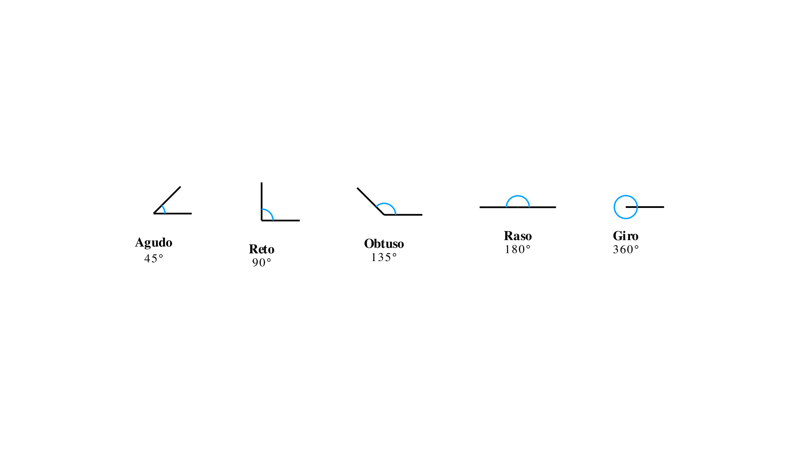{width=70%}

---

#### Pares de Ângulos

- **Complementares:** cuja soma é $90°$
- **Suplementares:** cuja soma é $180°$
- **Alterno internos/externos:** formados por uma secante em duas retas, em lados opostos
- **Verticalmente opostos:** têm o mesmo vértice e os lados de um estão no prolongamento dos lados do outro

**Propriedades:**

- Ângulos verticalmente opostos são iguais

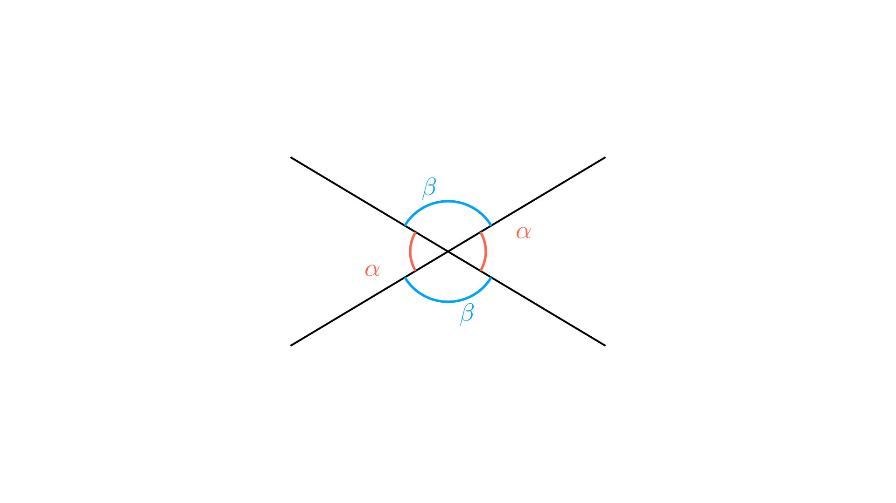{width=50%}

- Ângulos alternos internos são iguais quando as retas são paralelas

---

#### Medida de Amplitude

**Unidade de medida:**

- Grau $(°)$
- O ângulo giro tem amplitude igual a $360$ graus

**Subdivisões:**

- $1$ grau $= 60$ minutos $(')$
- $1$ minuto $= 60$ segundos $(")$

---

### Paralelismo e Perpendicularidade

**Retas paralelas:**
Retas que não se intersectam.

**Retas perpendiculares:**
Retas que formam ângulos retos.

**Propriedades:**

- Ângulos correspondentes são iguais quando as retas são paralelas
- Ângulos alternos internos e externos são iguais quando as retas são paralelas

---

```{=latex}
\switchcolumn
```

## Basic Elements

### Angles

#### Classification of Angles by Amplitude

- **Acute:** between $0°$ and $90°$
- **Right:** $90°$
- **Obtuse:** between $90°$ and $180°$
- **Straight:** $180°$
- **Full rotation:** $360°$

{width=70%}

---

#### Pairs of Angles

- **Complementary:** whose sum is $90°$
- **Supplementary:** whose sum is $180°$
- **Alternate interior/exterior:** formed by a transversal on two lines, on opposite sides
- **Vertically opposite:** have the same vertex and the sides of one are in the extension of the sides of the other

**Properties:**

- Vertically opposite angles are equal
- Alternate interior angles are equal when the lines are parallel

{width=50%}

---

#### Angle Measurement

**Unit of measurement:**

- Degree $(°)$
- The full rotation angle has amplitude equal to $360$ degrees

**Subdivisions:**

- $1$ degree $= 60$ minutes $(')$
- $1$ minute $= 60$ seconds $(")$

---

### Parallelism and Perpendicularity

**Parallel lines:**
Lines that do not intersect.

**Perpendicular lines:**
Lines that form right angles.

**Properties:**

- Corresponding angles are equal when the lines are parallel
- Alternate interior and exterior angles are equal when the lines are parallel

---

```{=latex}
\switchcolumn*
```

## Figuras Planas

### Triângulos

#### Classificação quanto aos Lados

- **Equilátero:** três lados iguais
- **Isósceles:** dois lados iguais
- **Escaleno:** três lados diferentes

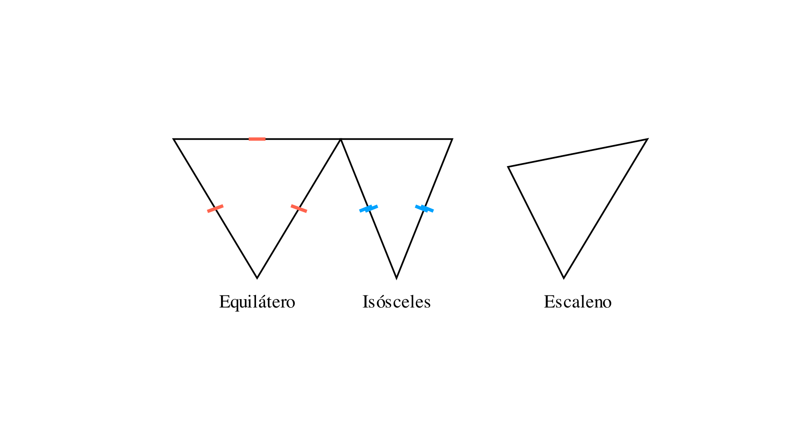{width=70%}

---

#### Classificação quanto aos Ângulos

- **Acutângulo:** três ângulos agudos
- **Retângulo:** um ângulo reto
- **Obtusângulo:** um ângulo obtuso

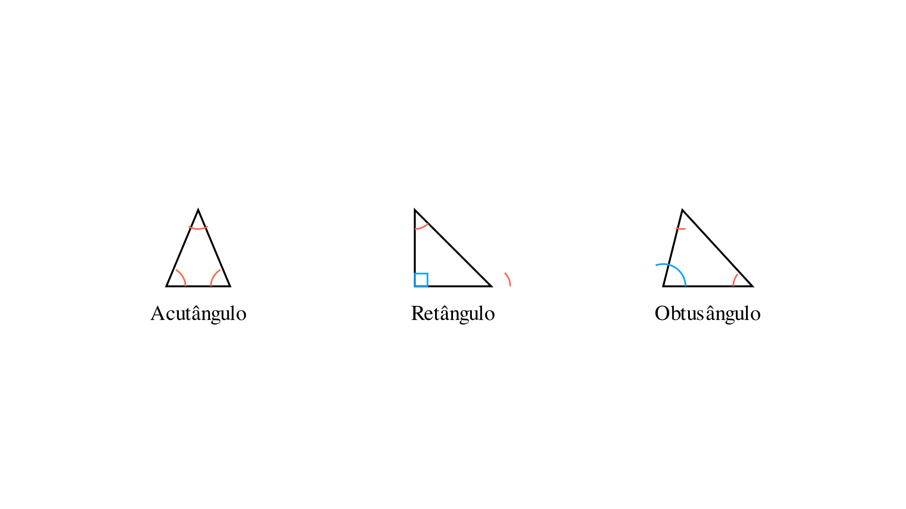{width=70%}

---

#### Propriedades dos Triângulos

**Soma dos ângulos internos:**
A soma dos ângulos internos de um triângulo é igual a $180°$.

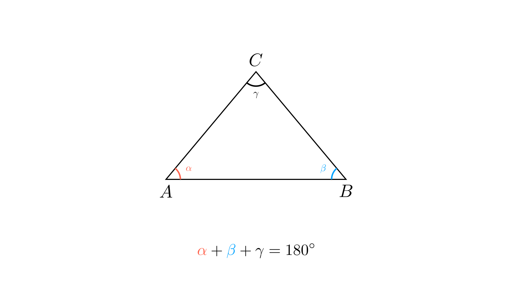{width=60%}

**Elementos de um triângulo retângulo:**

- **Hipotenusa:** lado oposto ao ângulo reto
- **Catetos:** lados adjacentes ao ângulo reto

**Desigualdade triangular:**
A medida do comprimento de qualquer lado é menor do que a soma das medidas dos comprimentos dos outros dois e maior do que a respetiva diferença.

---

#### Critérios de Igualdade de Triângulos

- **LLL:** Três lados iguais
- **LAL:** Dois lados e o ângulo por eles formado iguais
- **ALA:** Dois ângulos e o lado entre eles igual

---

### Quadriláteros

#### Tipos de Quadriláteros

**Paralelogramo:**
Lados opostos paralelos e iguais; ângulos opostos iguais.

**Losango:**
Quadrilátero paralelogramo; lados todos iguais.

**Retângulo:**
Quadrilátero paralelogramo; ângulos todos iguais (retos).

**Quadrado:**
Lados todos iguais; ângulos todos iguais (retos).

**Papagaio:**
Dois pares de lados consecutivos iguais.

**Trapézio:**
Quadrilátero com pelo menos dois lados paralelos.

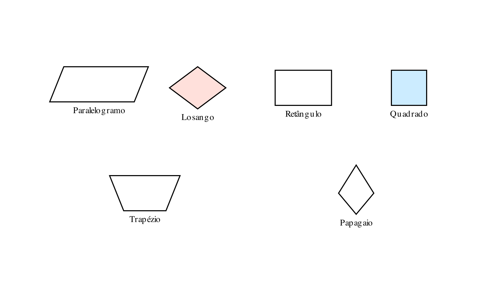{width=80%}

---

#### Propriedades das Diagonais

- **Paralelogramo:** bissetam-se
- **Losango:** bissetam-se e são perpendiculares
- **Retângulo:** bissetam-se e são iguais
- **Quadrado:** bissetam-se, são perpendiculares e iguais
- **Papagaio:** são perpendiculares

---

### Polígonos

#### Ângulos de um Polígono Convexo

**Fórmulas:**

- $S_i = (n - 2) \times 180°$ (soma dos ângulos internos)
- $S_e = 360°$ (soma dos ângulos externos)
- $a_i = \frac{(n - 2) \times 180°}{n}$ (ângulo interno)
- $a_e = \frac{360°}{n}$ (ângulo externo)
- $a_i + a_e = 180°$

---

### Circunferência e Círculo

**Elementos da circunferência:**

- **Centro:** ponto fixo
- **Raio:** distância do centro a qualquer ponto da circunferência
- **Diâmetro:** segmento que passa pelo centro e tem extremidades na circunferência
- **Corda:** segmento com extremidades na circunferência
- **Arco:** parte da circunferência entre dois pontos

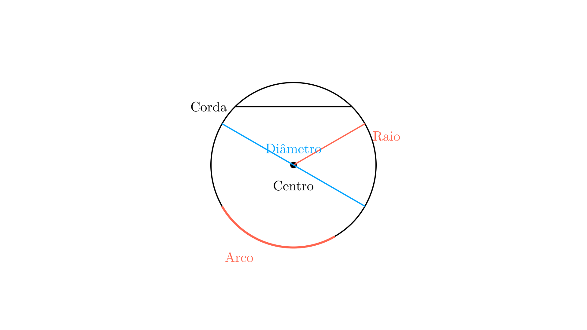{width=50%}

**Propriedades:**

- Diâmetro $= 2 \times$ raio
- Perímetro da circunferência $= \pi \times$ diâmetro $= 2 \times \pi \times$ raio
- $\pi \approx 3,1416$

---

#### Ângulos na Circunferência

**Ângulo ao centro:**
Ângulo de vértice no centro.

**Ângulo inscrito:**
Ângulo de vértice na circunferência.

**Setor circular:**
Interseção de um ângulo ao centro com o círculo.

---

### Lugares Geométricos

**Circunferência:**
Lugar geométrico dos pontos que estão a uma distância fixa de um ponto (centro).

**Círculo:**
Lugar geométrico dos pontos que estão a uma distância menor ou igual a um valor fixo de um ponto (centro).

**Mediatriz:**
Lugar geométrico dos pontos equidistantes das extremidades de um segmento.

**Bissetriz:**
Lugar geométrico dos pontos equidistantes de dois lados de um ângulo.

---

```{=latex}
\switchcolumn
```

## Plane Figures

### Triangles

#### Classification by Sides

- **Equilateral:** three equal sides
- **Isosceles:** two equal sides
- **Scalene:** three different sides

{width=70%}

---

#### Classification by Angles

- **Acute-angled:** three acute angles
- **Right-angled:** one right angle
- **Obtuse-angled:** one obtuse angle

{width=70%}

---

#### Properties of Triangles

**Sum of interior angles:**
The sum of the interior angles of a triangle equals $180°$.

{width=60%}

**Elements of a right triangle:**

- **Hypotenuse:** side opposite the right angle
- **Legs:** sides adjacent to the right angle

**Triangle inequality:**
The measure of the length of any side is less than the sum of the measures of the lengths of the other two and greater than their respective difference.

---

#### Criteria for Congruence of Triangles

- **SSS:** Three equal sides
- **SAS:** Two sides and the angle formed by them equal
- **ASA:** Two angles and the side between them equal

---

### Quadrilaterals

#### Types of Quadrilaterals

**Parallelogram:**
Opposite sides parallel and equal; opposite angles equal.

**Rhombus:**
Parallelogram quadrilateral; all sides equal.

**Rectangle:**
Parallelogram quadrilateral; all angles equal (right).

**Square:**
All sides equal; all angles equal (right).

**Kite:**
Two pairs of consecutive equal sides.

**Trapezoid:**
Quadrilateral with at least two parallel sides.

{width=80%}

---

#### Properties of Diagonals

- **Parallelogram:** bisect each other
- **Rhombus:** bisect each other and are perpendicular
- **Rectangle:** bisect each other and are equal
- **Square:** bisect each other, are perpendicular and equal
- **Kite:** are perpendicular

---

### Polygons

#### Angles of a Convex Polygon

**Formulas:**

- $S_i = (n - 2) \times 180°$ (sum of interior angles)
- $S_e = 360°$ (sum of exterior angles)
- $a_i = \frac{(n - 2) \times 180°}{n}$ (interior angle)
- $a_e = \frac{360°}{n}$ (exterior angle)
- $a_i + a_e = 180°$

---

### Circumference and Circle

**Elements of the circumference:**

- **Center:** fixed point
- **Radius:** distance from the center to any point on the circumference
- **Diameter:** segment that passes through the center and has endpoints on the circumference
- **Chord:** segment with endpoints on the circumference
- **Arc:** part of the circumference between two points

{width=50%}

**Properties:**

- Diameter $= 2 \times$ radius
- Perimeter of the circumference $= \pi \times$ diameter $= 2 \times \pi \times$ radius
- $\pi \approx 3,1416$

---

#### Angles in the Circumference

**Central angle:**
Angle with vertex at the center.

**Inscribed angle:**
Angle with vertex on the circumference.

**Circular sector:**
Intersection of a central angle with the circle.

---

### Loci

**Circumference:**
Locus of points that are at a fixed distance from a point (center).

**Circle:**
Locus of points that are at a distance less than or equal to a fixed value from a point (center).

**Perpendicular bisector:**
Locus of points equidistant from the endpoints of a segment.

**Angle bisector:**
Locus of points equidistant from two sides of an angle.

---

```{=latex}
\switchcolumn*
```

## Transformações Geométricas

### Isometrias

**Isometria:**
Transformação geométrica que preserva distâncias.

---

#### Reflexão Central

Um ponto $M'$ é a imagem de $M$ numa reflexão central de centro $O$ quando $O$ é o ponto médio do segmento $[MM']$.

**Propriedades:**

- Preserva comprimentos de segmentos
- Preserva amplitudes de ângulos

---

#### Reflexão Axial

Um ponto $M'$ é a imagem de $M$ numa reflexão axial de eixo $r$ quando $r$ é a mediatriz do segmento $[MM']$.

**Propriedades:**

- Preserva comprimentos de segmentos
- Preserva amplitudes de ângulos

**Eixo de simetria:**
Linha que divide uma figura em duas partes que são imagens uma da outra por reflexão axial.

![Reflexão axial de uma figura em relação ao eixo r, mostrando que r é a mediatriz do segmento [MM']](images/reflexao_axial.png){width=60%}

---

#### Rotação

Um ponto $M'$ é a imagem de $M$ por uma rotação de centro $O$ e ângulo $\alpha$ quando:

- Os segmentos $[OM]$ e $[OM']$ têm comprimento igual
- O ângulo $M\hat{O}M'$ tem amplitude $\alpha$

**Propriedades:**

- Preserva comprimentos de segmentos
- Preserva amplitudes de ângulos

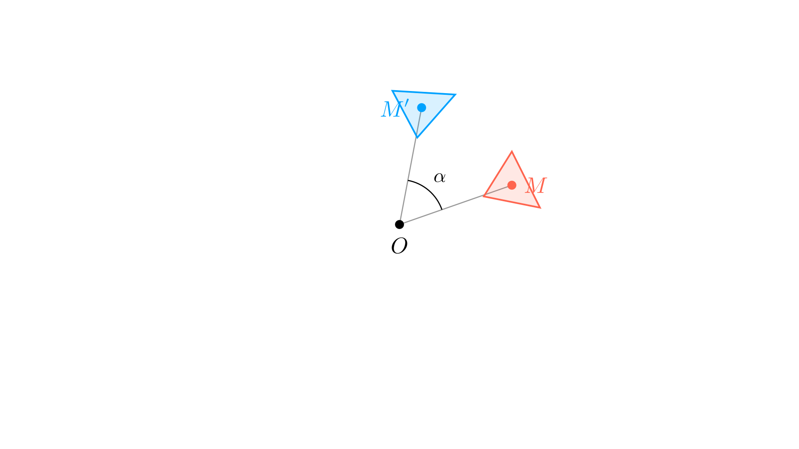{width=50%}

---

#### Translação

Uma translação é definida por um vetor que indica:

- Direção
- Sentido
- Comprimento

**Propriedades:**

- Preserva comprimentos de segmentos
- Preserva amplitudes de ângulos
- Preserva paralelismo

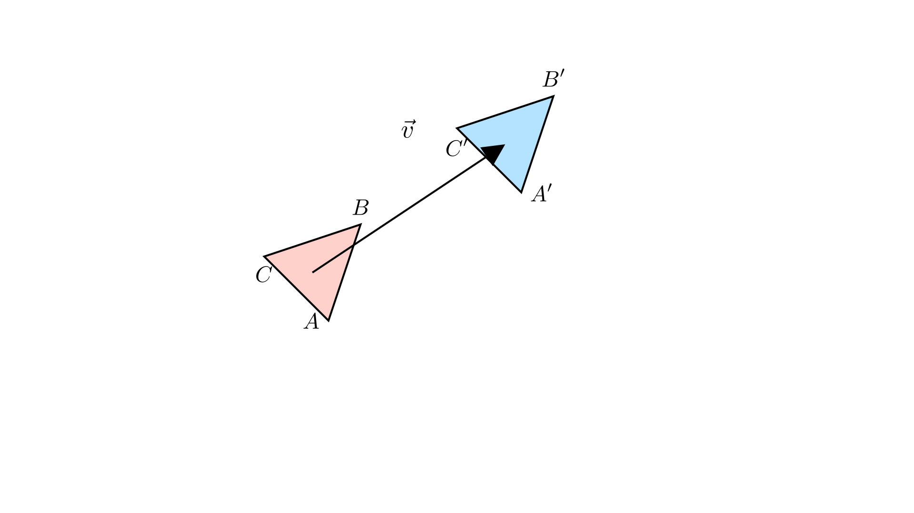{width=50%}

---

### Semelhanças

**Figuras semelhantes:**

- Têm a mesma forma
- Distâncias entre pares de pontos correspondentes são diretamente proporcionais

---

#### Polígonos Semelhantes

**Propriedades:**

- Ângulos correspondentes iguais
- Lados correspondentes diretamente proporcionais

**Razão de semelhança ($r$):**
Constante de proporcionalidade entre o comprimento dos lados correspondentes.

**Classificação:**

- **Ampliação:** $r > 1$
- **Redução:** $0 < r < 1$
- **Isometria:** $r = 1$

---

#### Relação entre Perímetros e Áreas

**Perímetros:**
Perímetro da figura semelhante $=$ Perímetro original $\times r$

**Áreas:**
Área da figura semelhante $=$ Área original $\times r^2$

---

#### Critérios de Semelhança de Triângulos

**Critério AA (Ângulo-Ângulo):**
Dois ângulos correspondentes iguais determinam semelhança.

**Critério LLL (Lado-Lado-Lado):**
Três lados diretamente proporcionais determinam semelhança.

**Critério LAL (Lado-Ângulo-Lado):**
Dois lados diretamente proporcionais e o ângulo correspondente igual determinam semelhança.

---

```{=latex}
\switchcolumn
```

## Geometric Transformations

### Isometries

**Isometry:**
Geometric transformation that preserves distances.

---

#### Central Reflection

A point $M'$ is the image of $M$ in a central reflection with center $O$ when $O$ is the midpoint of segment $[MM']$.

**Properties:**

- Preserves segment lengths
- Preserves angle measures

---

#### Axial Reflection

A point $M'$ is the image of $M$ in an axial reflection with axis $r$ when $r$ is the perpendicular bisector of segment $[MM']$.

**Properties:**

- Preserves segment lengths
- Preserves angle measures

**Axis of symmetry:**
Line that divides a figure into two parts that are images of each other by axial reflection.

![Axial reflection of a figure with respect to axis r, showing that r is the perpendicular bisector of segment [MM']](images/reflexao_axial.png){width=60%}

---

#### Rotation

A point $M'$ is the image of $M$ by a rotation with center $O$ and angle $\alpha$ when:

- The segments $[OM]$ and $[OM']$ have equal length
- The angle $M\hat{O}M'$ has measure $\alpha$

**Properties:**

- Preserves segment lengths
- Preserves angle measures

{width=50%}

---

#### Translation

A translation is defined by a vector that indicates:

- Direction
- Sense
- Length

**Properties:**

- Preserves segment lengths
- Preserves angle measures
- Preserves parallelism

{width=50%}

---

### Similarities

**Similar figures:**

- Have the same shape
- Distances between pairs of corresponding points are directly proportional

---

#### Similar Polygons

**Properties:**

- Corresponding angles equal
- Corresponding sides directly proportional

**Similarity ratio ($r$):**
Constant of proportionality between the length of corresponding sides.

**Classification:**

- **Enlargement:** $r > 1$
- **Reduction:** $0 < r < 1$
- **Isometry:** $r = 1$

---

#### Relationship between Perimeters and Areas

**Perimeters:**
Perimeter of similar figure $=$ Original perimeter $\times r$

**Areas:**
Area of similar figure $=$ Original area $\times r^2$

---

#### Criteria for Similarity of Triangles

**AA Criterion (Angle-Angle):**
Two equal corresponding angles determine similarity.

**SSS Criterion (Side-Side-Side):**
Three directly proportional sides determine similarity.

**SAS Criterion (Side-Angle-Side):**
Two directly proportional sides and the corresponding angle equal determine similarity.

---

```{=latex}
\switchcolumn*
```

## Sólidos Geométricos

### Poliedros

**Poliedro:**
Sólido apenas com faces planas.

**Elementos:**

- **Faces:** polígonos que limitam o poliedro
- **Arestas:** segmentos de interseção de duas faces
- **Vértices:** pontos de interseção de três ou mais arestas

---

#### Poliedros Regulares (Platónicos)

Sólido cujas faces são polígonos regulares iguais e cada vértice é comum ao mesmo número de faces.

**Cinco poliedros regulares:**

- **Tetraedro:** $4$ faces triangulares
- **Cubo:** $6$ faces quadrangulares
- **Octaedro:** $8$ faces triangulares
- **Dodecaedro:** $12$ faces pentagonais
- **Icosaedro:** $20$ faces triangulares

---

#### Fórmula de Euler

$$V + F = A + 2$$

Onde:

- $V =$ número de vértices
- $F =$ número de faces
- $A =$ número de arestas

---

### Prismas

**Prisma:**
Poliedro com duas faces geometricamente iguais (bases) situadas em planos paralelos.

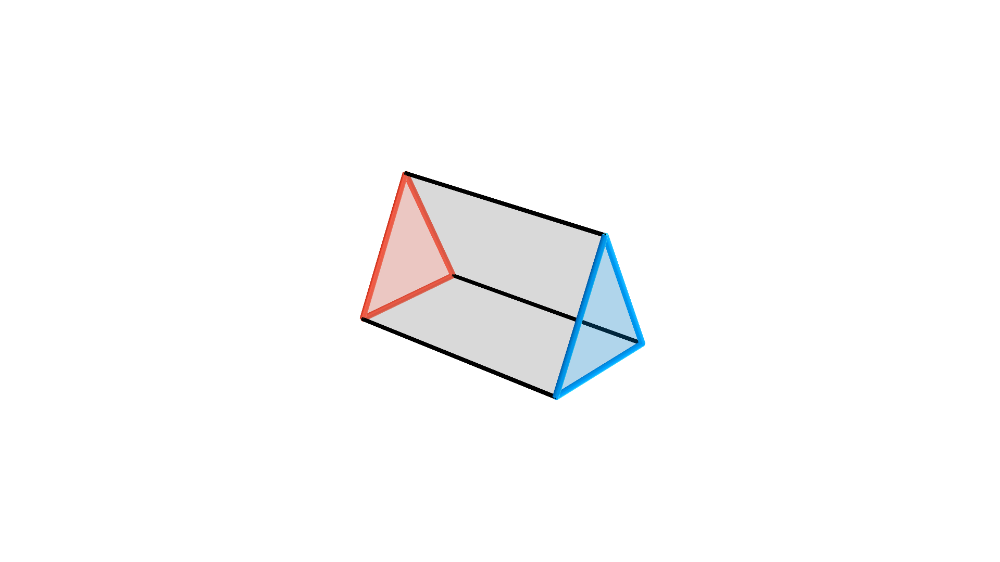{width=50%}

**Num prisma com base de $n$ lados:**

- Número de vértices $= 2n$
- Número de arestas $= 3n$
- Número de faces $= n + 2$

**Prisma reto:**
Arestas laterais perpendiculares às bases.

**Prisma regular:**
Prisma reto com bases em polígonos regulares.

---

### Pirâmides

**Pirâmide:**
Poliedro determinado por um polígono (base) e um ponto exterior ao plano da base (vértice).

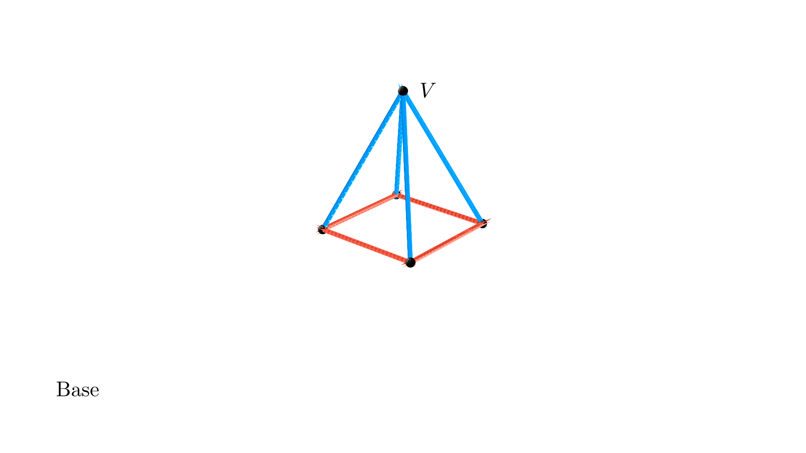{width=50%}

**Numa pirâmide com base de $n$ lados:**

- Número de vértices $= n + 1$
- Número de arestas $= 2n$
- Número de faces $= n + 1$

**Pirâmide regular:**
Base é um polígono regular e arestas laterais são todas iguais.

---

### Cilindros

**Cilindro:**
Sólido determinado por dois círculos com raio igual em planos paralelos.

**Elementos:**

- **Bases:** os dois círculos
- **Eixo:** segmento que une os centros das bases
- **Geratrizes:** segmentos que unem pontos das circunferências das bases
- **Superfície lateral:** união de todas as geratrizes

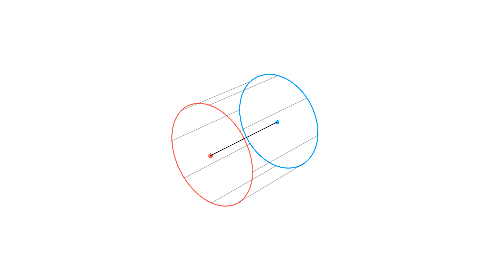{width=50%}

**Cilindro reto:**
Eixo perpendicular aos raios das bases.

---

### Cones

**Cone:**
Sólido determinado por um círculo (base) e um ponto exterior ao plano da base (vértice).

**Elementos:**

- **Base:** círculo
- **Vértice:** ponto exterior ao plano da base
- **Eixo:** segmento que une o vértice ao centro da base
- **Geratrizes:** segmentos que unem o vértice a pontos da circunferência da base
- **Superfície lateral:** união de todas as geratrizes

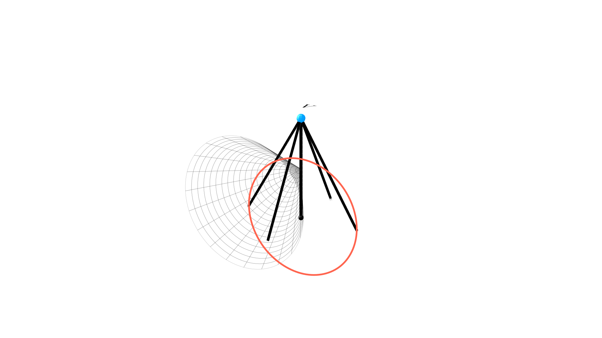{width=50%}

**Cone reto:**
Eixo perpendicular ao raio da base.

---

### Esfera

**Esfera:**
Sólido constituído por todos os pontos do espaço que estão a uma distância menor ou igual a um valor fixo (raio) de um ponto (centro).

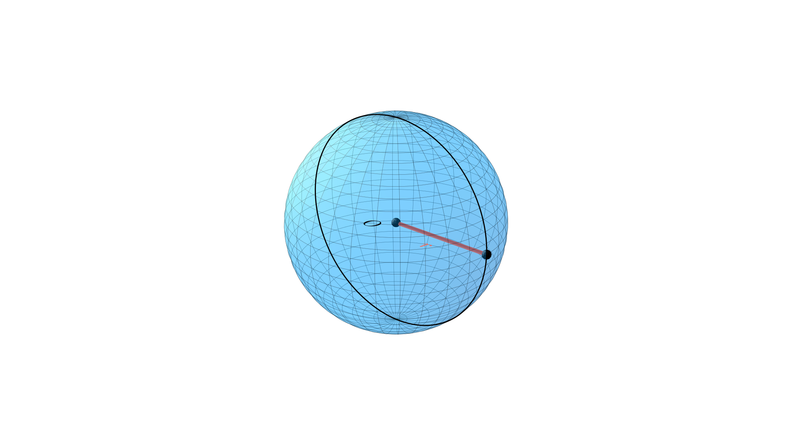{width=50%}

**Superfície esférica:**
Conjunto de pontos do espaço que estão a uma distância igual ao raio do centro.

---

```{=latex}
\switchcolumn
```

## Geometric Solids

### Polyhedra

**Polyhedron:**
Solid with only flat faces.

**Elements:**

- **Faces:** polygons that bound the polyhedron
- **Edges:** segments of intersection of two faces
- **Vertices:** points of intersection of three or more edges

---

#### Regular Polyhedra (Platonic)

Solid whose faces are equal regular polygons and each vertex is common to the same number of faces.

**Five regular polyhedra:**

- **Tetrahedron:** $4$ triangular faces
- **Cube:** $6$ quadrangular faces
- **Octahedron:** $8$ triangular faces
- **Dodecahedron:** $12$ pentagonal faces
- **Icosahedron:** $20$ triangular faces

---

#### Euler's Formula

$$V + F = A + 2$$

Where:

- $V =$ number of vertices
- $F =$ number of faces
- $A =$ number of edges

---

### Prisms

**Prism:**
Polyhedron with two geometrically equal faces (bases) situated in parallel planes.

{width=50%}

**In a prism with base of $n$ sides:**

- Number of vertices $= 2n$
- Number of edges $= 3n$
- Number of faces $= n + 2$

**Right prism:**
Lateral edges perpendicular to the bases.

**Regular prism:**
Right prism with bases that are regular polygons.

---

### Pyramids

**Pyramid:**
Polyhedron determined by a polygon (base) and a point exterior to the plane of the base (vertex).

{width=50%}

**In a pyramid with base of $n$ sides:**

- Number of vertices $= n + 1$
- Number of edges $= 2n$
- Number of faces $= n + 1$

**Regular pyramid:**
Base is a regular polygon and lateral edges are all equal.

---

### Cylinders

**Cylinder:**
Solid determined by two circles with equal radius in parallel planes.

**Elements:**

- **Bases:** the two circles
- **Axis:** segment that joins the centers of the bases
- **Generators:** segments that join points of the circumferences of the bases
- **Lateral surface:** union of all generators

{width=50%}

**Right cylinder:**
Axis perpendicular to the radii of the bases.

---

### Cones

**Cone:**
Solid determined by a circle (base) and a point exterior to the plane of the base (vertex).

**Elements:**

- **Base:** circle
- **Vertex:** point exterior to the plane of the base
- **Axis:** segment that joins the vertex to the center of the base
- **Generators:** segments that join the vertex to points of the circumference of the base
- **Lateral surface:** union of all generators

{width=50%}

**Right cone:**
Axis perpendicular to the radius of the base.

---

### Sphere

**Sphere:**
Solid constituted by all points in space that are at a distance less than or equal to a fixed value (radius) from a point (center).

{width=50%}

**Spherical surface:**
Set of points in space that are at a distance equal to the radius from the center.

---

```{=latex}
\switchcolumn*
```

## Trigonometria

### Teorema de Pitágoras

**Enunciado:**
Num triângulo retângulo, o quadrado da hipotenusa é igual à soma dos quadrados dos catetos.

**Fórmula:**
$$a^2 + b^2 = c^2$$

Onde:

- $c =$ hipotenusa
- $a, b =$ catetos

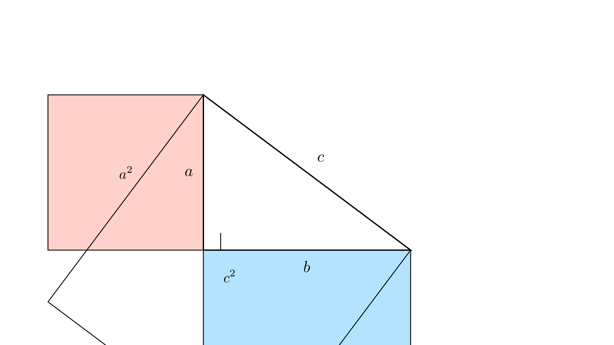{width=60%}

---

#### Recíproco do Teorema de Pitágoras

Se num triângulo o quadrado de um lado é igual à soma dos quadrados dos outros dois lados, então o triângulo é retângulo.

---

#### Ternos Pitagóricos

Conjunto de três números naturais $(a, b, c)$ que verificam $a^2 + b^2 = c^2$.

**Exemplos:**

- $(3, 4, 5)$
- $(5, 12, 13)$
- $(8, 15, 17)$

---

#### Teorema de Pitágoras no Espaço

Aplicação do Teorema de Pitágoras ao cálculo de diagonais espaciais em sólidos geométricos.

---

### Razões Trigonométricas

#### Definições

Num triângulo retângulo com um ângulo agudo $\alpha$:

**Seno:**
$$\sin \alpha = \frac{\text{cateto oposto}}{\text{hipotenusa}}$$

**Cosseno:**
$$\cos \alpha = \frac{\text{cateto adjacente}}{\text{hipotenusa}}$$

**Tangente:**
$$\tan \alpha = \frac{\text{cateto oposto}}{\text{cateto adjacente}}$$

---

#### Relações entre Razões Trigonométricas

**Relação fundamental:**
$$\sin^2\alpha + \cos^2\alpha = 1$$

**Tangente:**
$$\tan \alpha = \frac{\sin \alpha}{\cos \alpha}$$

**Ângulos complementares:**

- $\sin \alpha = \cos (90° - \alpha)$
- $\cos \alpha = \sin (90° - \alpha)$

---

#### Valores Exatos

**Ângulo de $30°$:**

- $\sin 30° = \frac{1}{2}$
- $\cos 30° = \frac{\sqrt{3}}{2}$
- $\tan 30° = \frac{\sqrt{3}}{3}$

**Ângulo de $45°$:**

- $\sin 45° = \frac{\sqrt{2}}{2}$
- $\cos 45° = \frac{\sqrt{2}}{2}$
- $\tan 45° = 1$

**Ângulo de $60°$:**

- $\sin 60° = \frac{\sqrt{3}}{2}$
- $\cos 60° = \frac{1}{2}$
- $\tan 60° = \sqrt{3}$

---

# MEDIDA

```{=latex}
\switchcolumn
```

## Trigonometry

### Pythagorean Theorem

**Statement:**
In a right triangle, the square of the hypotenuse equals the sum of the squares of the legs.

**Formula:**
$$a^2 + b^2 = c^2$$

Where:

- $c =$ hypotenuse
- $a, b =$ legs

{width=60%}

---

#### Converse of the Pythagorean Theorem

If in a triangle the square of one side equals the sum of the squares of the other two sides, then the triangle is right-angled.

---

#### Pythagorean Triples

Set of three natural numbers $(a, b, c)$ that satisfy $a^2 + b^2 = c^2$.

**Examples:**

- $(3, 4, 5)$
- $(5, 12, 13)$
- $(8, 15, 17)$

---

#### Pythagorean Theorem in Space

Application of the Pythagorean Theorem to the calculation of space diagonals in geometric solids.

---

### Trigonometric Ratios

#### Definitions

In a right triangle with an acute angle $\alpha$:

**Sine:**
$$\sin \alpha = \frac{\text{opposite leg}}{\text{hypotenuse}}$$

**Cosine:**
$$\cos \alpha = \frac{\text{adjacent leg}}{\text{hypotenuse}}$$

**Tangent:**
$$\tan \alpha = \frac{\text{opposite leg}}{\text{adjacent leg}}$$

---

#### Relations between Trigonometric Ratios

**Fundamental relation:**
$$\sin^2\alpha + \cos^2\alpha = 1$$

**Tangent:**
$$\tan \alpha = \frac{\sin \alpha}{\cos \alpha}$$

**Complementary angles:**

- $\sin \alpha = \cos (90° - \alpha)$
- $\cos \alpha = \sin (90° - \alpha)$

---

#### Exact Values

**Angle of $30°$:**

- $\sin 30° = \frac{1}{2}$
- $\cos 30° = \frac{\sqrt{3}}{2}$
- $\tan 30° = \frac{\sqrt{3}}{3}$

**Angle of $45°$:**

- $\sin 45° = \frac{\sqrt{2}}{2}$
- $\cos 45° = \frac{\sqrt{2}}{2}$
- $\tan 45° = 1$

**Angle of $60°$:**

- $\sin 60° = \frac{\sqrt{3}}{2}$
- $\cos 60° = \frac{1}{2}$
- $\tan 60° = \sqrt{3}$

---

# MEASUREMENT

```{=latex}
\switchcolumn*
```

## Área

### Conceitos Fundamentais

**Área:**
Medida da superfície de uma figura plana.

**Unidades de medida:**

- $\text{m}^2$ (metro quadrado)
- $\text{cm}^2$ (centímetro quadrado)
- $\text{mm}^2$ (milímetro quadrado)
- $\text{km}^2$ (quilómetro quadrado)

---

### Fórmulas de Áreas

#### Figuras Básicas

**Triângulo:**
$$A = \frac{\text{base} \times \text{altura}}{2}$$

**Quadrado:**
$$A = \text{lado} \times \text{lado} = \text{lado}^2$$

**Retângulo:**
$$A = \text{comprimento} \times \text{largura}$$

**Paralelogramo:**
$$A = \text{base} \times \text{altura}$$

---

#### Quadriláteros Especiais

**Losango e Papagaio:**
$$A = \frac{\text{Diagonal maior} \times \text{diagonal menor}}{2}$$

**Trapézio:**
$$A = \frac{\text{Base maior} + \text{base menor}}{2} \times \text{altura}$$

---

#### Polígonos Regulares e Círculo

**Polígono regular:**
$$A = \frac{\text{Perímetro}}{2} \times \text{apótema}$$

**Círculo:**
$$A = \pi \times \text{raio}^2$$

**Setor circular:**
$$A = \frac{\pi \times \text{raio}^2 \times \text{amplitude do ângulo}}{360°}$$

---

### Construção de Fórmulas

**Área do retângulo:**
Reconhecer que a área de um retângulo de lados $q$ e $r$ é igual a $q \times r$ unidades quadradas.

**Área do paralelogramo:**
Reconhecer que um paralelogramo com base $b$ e altura $a$ tem área $= b \times a$.

**Área do triângulo:**
Reconhecer que um triângulo com base $b$ e altura $a$ tem área $= \frac{b \times a}{2}$.

---

```{=latex}
\switchcolumn
```

## Area

### Fundamental Concepts

**Area:**
Measure of the surface of a plane figure.

**Units of measurement:**

- $\text{m}^2$ (square meter)
- $\text{cm}^2$ (square centimeter)
- $\text{mm}^2$ (square millimeter)
- $\text{km}^2$ (square kilometer)

---

### Area Formulas

#### Basic Figures

**Triangle:**
$$A = \frac{\text{base} \times \text{height}}{2}$$

**Square:**
$$A = \text{side} \times \text{side} = \text{side}^2$$

**Rectangle:**
$$A = \text{length} \times \text{width}$$

**Parallelogram:**
$$A = \text{base} \times \text{height}$$

---

#### Special Quadrilaterals

**Rhombus and Kite:**
$$A = \frac{\text{Major diagonal} \times \text{minor diagonal}}{2}$$

**Trapezoid:**
$$A = \frac{\text{Major base} + \text{minor base}}{2} \times \text{height}$$

---

#### Regular Polygons and Circle

**Regular polygon:**
$$A = \frac{\text{Perimeter}}{2} \times \text{apothem}$$

**Circle:**
$$A = \pi \times \text{radius}^2$$

**Circular sector:**
$$A = \frac{\pi \times \text{radius}^2 \times \text{angle measure}}{360°}$$

---

### Construction of Formulas

**Area of rectangle:**
Recognize that the area of a rectangle with sides $q$ and $r$ equals $q \times r$ square units.

**Area of parallelogram:**
Recognize that a parallelogram with base $b$ and height $a$ has area $= b \times a$.

**Area of triangle:**
Recognize that a triangle with base $b$ and height $a$ has area $= \frac{b \times a}{2}$.

---

```{=latex}
\switchcolumn*
```

## Volume

### Conceitos Fundamentais

**Volume:**
Medida do espaço ocupado por um sólido.

**Unidades de medida:**

- $\text{m}^3$ (metro cúbico)
- $\text{cm}^3$ (centímetro cúbico)
- $\text{mm}^3$ (milímetro cúbico)
- $\text{L}$ (litro) $= \text{dm}^3$

---

### Fórmulas de Volumes

#### Prismas

**Prisma (geral):**
$$V = \text{área da base} \times \text{altura}$$

**Paralelepípedo retângulo:**
$$V = \text{comprimento} \times \text{largura} \times \text{altura}$$

**Cubo:**
$$V = \text{aresta}^3$$

---

#### Pirâmides

**Pirâmide:**
$$V = \frac{\text{área da base} \times \text{altura}}{3}$$

---

#### Cilindros

**Cilindro:**
$$V = \text{área da base} \times \text{altura} = \pi \times \text{raio}^2 \times \text{altura}$$

---

#### Cones

**Cone:**
$$V = \frac{\text{área da base} \times \text{altura}}{3} = \frac{\pi \times \text{raio}^2 \times \text{altura}}{3}$$

---

#### Esfera

**Esfera:**
$$V = \frac{4 \times \pi \times \text{raio}^3}{3}$$

---

### Áreas da Superfície de Sólidos

#### Prismas e Pirâmides

**Prisma:**
Área total $=$ área das duas bases $+$ área da superfície lateral

**Pirâmide:**
Área total $=$ área da base $+$ área da superfície lateral

---

#### Cilindros e Cones

**Cilindro:**
$$\text{Área total} = 2 \times \pi \times \text{raio}^2 + 2 \times \pi \times \text{raio} \times \text{altura}$$

**Cone:**
$$\text{Área total} = \pi \times \text{raio}^2 + \pi \times \text{raio} \times \text{geratriz}$$

---

#### Esfera

**Superfície esférica:**
$$A = 4 \times \pi \times \text{raio}^2$$

---

# ORGANIZAÇÃO E TRATAMENTO DE DADOS

```{=latex}
\switchcolumn
```

## Volume

### Fundamental Concepts

**Volume:**
Measure of the space occupied by a solid.

**Units of measurement:**

- $\text{m}^3$ (cubic meter)
- $\text{cm}^3$ (cubic centimeter)
- $\text{mm}^3$ (cubic millimeter)
- $\text{L}$ (liter) $= \text{dm}^3$

---

### Volume Formulas

#### Prisms

**Prism (general):**
$$V = \text{base area} \times \text{height}$$

**Rectangular parallelepiped:**
$$V = \text{length} \times \text{width} \times \text{height}$$

**Cube:**
$$V = \text{edge}^3$$

---

#### Pyramids

**Pyramid:**
$$V = \frac{\text{base area} \times \text{height}}{3}$$

---

#### Cylinders

**Cylinder:**
$$V = \text{base area} \times \text{height} = \pi \times \text{radius}^2 \times \text{height}$$

---

#### Cones

**Cone:**
$$V = \frac{\text{base area} \times \text{height}}{3} = \frac{\pi \times \text{radius}^2 \times \text{height}}{3}$$

---

#### Sphere

**Sphere:**
$$V = \frac{4 \times \pi \times \text{radius}^3}{3}$$

---

### Surface Areas of Solids

#### Prisms and Pyramids

**Prism:**
Total area $=$ area of two bases $+$ lateral surface area

**Pyramid:**
Total area $=$ base area $+$ lateral surface area

---

#### Cylinders and Cones

**Cylinder:**
$$\text{Total area} = 2 \times \pi \times \text{radius}^2 + 2 \times \pi \times \text{radius} \times \text{height}$$

**Cone:**
$$\text{Total area} = \pi \times \text{radius}^2 + \pi \times \text{radius} \times \text{slant height}$$

---

#### Sphere

**Spherical surface:**
$$A = 4 \times \pi \times \text{radius}^2$$

---

# DATA ORGANIZATION AND PROCESSING

```{=latex}
\switchcolumn*
```

## Representação de Dados

### Conceitos Básicos

**População estatística:**
Conjunto de elementos sobre os quais se pretende estudar uma ou mais características em comum.

**Amostra estatística:**
Parte da população sobre a qual são recolhidos dados; deve ser representativa da população.

**Variável estatística:**
Característica que toma diferentes valores.

---

### Tipos de Variáveis

**Variável quantitativa:**

- **Discreta:** contagem (número de irmãos)
- **Contínua:** medição (altura)

**Variável qualitativa:**

- **Nominal:** categorias sem ordem (cor dos olhos)
- **Ordinal:** categorias com ordem (habilitações)

---

### Recolha e Organização de Dados

**Recenseamento (ou censo):**
Estudo estatístico que envolve a observação de todos os elementos da população.

**Sondagem:**
Estudo estatístico que envolve a observação dos elementos de uma amostra.

**Dados organizados em classes:**
Quando existe grande variabilidade de valores, agrupam-se em classes com determinada amplitude.

---

### Formas de Representação

**Tabelas:**

- Tabela de frequências absolutas e relativas

**Gráficos:**

- Gráficos cartesianos
- Pictogramas
- Diagrama de caule e folhas
- Gráfico de barras
- Gráfico circular
- Gráfico de linha/linhas
- Gráfico de barras justapostas
- Gráfico de barras sobrepostas
- Histogramas

---

```{=latex}
\switchcolumn
```

## Data Representation

### Basic Concepts

**Statistical population:**
Set of elements about which one or more common characteristics are to be studied.

**Statistical sample:**
Part of the population about which data are collected; must be representative of the population.

**Statistical variable:**
Characteristic that takes different values.

---

### Types of Variables

**Quantitative variable:**

- **Discrete:** counting (number of siblings)
- **Continuous:** measurement (height)

**Qualitative variable:**

- **Nominal:** categories without order (eye color)
- **Ordinal:** categories with order (qualifications)

---

### Data Collection and Organization

**Census:**
Statistical study that involves the observation of all elements of the population.

**Survey:**
Statistical study that involves the observation of elements of a sample.

**Data organized in classes:**
When there is great variability of values, they are grouped into classes with a certain range.

---

### Forms of Representation

**Tables:**

- Table of absolute and relative frequencies

**Graphs:**

- Cartesian graphs
- Pictograms
- Stem-and-leaf diagram
- Bar graph
- Pie chart
- Line graph/graphs
- Juxtaposed bar graph
- Stacked bar graph
- Histograms

---

```{=latex}
\switchcolumn*
```

## Estatística

### Medidas de Localização Central

**Média aritmética ($\bar{x}$):**
Calcula-se somando todos os valores de um conjunto de dados e dividindo essa soma pelo número de elementos desse conjunto.

**Moda ($M_o$):**
Valor de maior frequência.

**Mediana ($M_e$):**

- Se o número de dados for ímpar: dado da posição central, com os dados colocados por ordem
- Se o número de dados for par: média aritmética dos dados das duas posições centrais

---

### Medidas de Dispersão

**Amplitude:**
Diferença entre o valor máximo e o valor mínimo.

---

### Exemplo

Dados: $1, 1, 2, 3, 3, 4$

- $\bar{x} = (2 \times 1 + 2 + 2 \times 3 + 4) \div 6 = 14 \div 6 \approx 2,3$
- $M_o = 1$ e $3$
- $M_e = (2 + 3) \div 2 = 2,5$
- Amplitude $= 4 - 1 = 3$

---

### Histogramas

**Características:**

- Classes no eixo das abcissas
- Frequências no eixo das ordenadas
- Barras retangulares justapostas
- Área proporcional à frequência absoluta

**Classe modal:**
Classe com maior frequência absoluta.

---

```{=latex}
\switchcolumn
```

## Statistics

### Measures of Central Location

**Arithmetic mean ($\bar{x}$):**
Calculated by adding all values of a data set and dividing that sum by the number of elements in that set.

**Mode ($M_o$):**
Value with highest frequency.

**Median ($M_e$):**

- If the number of data is odd: data in the central position, with data placed in order
- If the number of data is even: arithmetic mean of the data in the two central positions

---

### Measures of Dispersion

**Range:**
Difference between the maximum value and the minimum value.

---

### Example

Data: $1, 1, 2, 3, 3, 4$

- $\bar{x} = (2 \times 1 + 2 + 2 \times 3 + 4) \div 6 = 14 \div 6 \approx 2,3$
- $M_o = 1$ and $3$
- $M_e = (2 + 3) \div 2 = 2,5$
- Range $= 4 - 1 = 3$

---

### Histograms

**Characteristics:**

- Classes on the abscissa axis
- Frequencies on the ordinate axis
- Juxtaposed rectangular bars
- Area proportional to absolute frequency

**Modal class:**
Class with highest absolute frequency.

---

```{=latex}
\switchcolumn*
```

## Probabilidades

### Experiências Aleatórias

**Experiência determinista:**
Permite prever o resultado, possuindo apenas um caso possível.

**Experiência aleatória:**
Depende da sorte e do acaso, apresentando um conjunto de casos possíveis denominado universo de resultados ou espaço amostral ($\Omega$).

**Exemplo:**
Lançar um dado: $\Omega = \{1, 2, 3, 4, 5, 6\}$ com $\#\Omega = 6$

---

### Acontecimentos

**Acontecimento:**
Subconjunto do universo de resultados.

**Classificação:**

- **Elementar:** constituído por um único elemento
- **Composto:** constituído por dois ou mais elementos
- **Certo:** contém todos os elementos do universo de resultados
- **Impossível:** não contém qualquer elemento ($\emptyset$)

---

### Operações com Acontecimentos

**Reunião ($A \cup B$):**
Resultados que pertencem a pelo menos um dos acontecimentos $A$ ou $B$.

**Interseção ($A \cap B$):**
Resultados que pertencem simultaneamente a $A$ e $B$.

**Acontecimentos compatíveis:**
Possuem pelo menos um elemento em comum ($A \cap B \neq \emptyset$).

**Acontecimentos incompatíveis:**
Não possuem elementos em comum ($A \cap B = \emptyset$).

**Acontecimentos complementares ou contrários:**
$A \cap B = \emptyset \land A \cup B = \Omega$

O contrário de $A$ representa-se por $\bar{A}$.

---

### Probabilidade

**Escala de probabilidades:**
A probabilidade de um acontecimento varia entre $0$ e $1$ (ou $0\%$ e $100\%$).

$$0 \leq P(A) \leq 1 \text{ ou } 0\% \leq P(A) \leq 100\%$$

**Classificação:**

- **Acontecimento certo:** $P(A) = 1$ (ou $100\%$)
- **Acontecimento impossível:** $P(A) = 0$ (ou $0\%$)
- **Acontecimentos equiprováveis:** têm a mesma probabilidade

---

### Cálculo da Probabilidade

**Lei de Laplace:**

$$P(A) = \frac{\text{número de casos favoráveis a } A}{\text{número de casos possíveis}}$$

**Exemplo:**
Lançar um dado. Acontecimento $A$ "sair face com múltiplo de $5$" $= \{5\}$

$$P(A) = \frac{1}{6} \approx 0,167 \approx 16,7\%$$

---

### Probabilidade de Acontecimentos Compostos

A probabilidade de um acontecimento composto é igual à soma das probabilidades dos acontecimentos elementares que o compõem.

**Exemplo:**
"Sair múltiplo de $3$" ao lançar um dado $= \{3, 6\}$

$$P = \frac{1}{6} + \frac{1}{6} = \frac{2}{6} = \frac{1}{3}$$

---

### Esquemas Auxiliares de Contagem

**Diagrama de Venn:**
Útil para experiências com uma só ação e para visualizar reunião e interseção.

**Tabela de dupla entrada:**
Útil para experiências com duas ações.

**Diagrama em árvore:**
Útil para experiências com duas ou mais ações.

---

### Lei dos Grandes Números

Quando se repete um número elevado de vezes uma experiência, a frequência relativa de um acontecimento tende a aproximar-se do valor da probabilidade desse acontecimento:

$$F_r(A) \approx P(A)$$

Quanto maior o número de repetições, mais próximo será o valor da frequência relativa em relação à probabilidade.

---

**Conteúdo adaptado de O Bichinho do Saber (www.obichinhodosaber.com)**

```{=latex}
\switchcolumn
```

## Probability

### Random Experiments

**Deterministic experiment:**
Allows predicting the result, having only one possible case.

**Random experiment:**
Depends on luck and chance, presenting a set of possible cases called the outcome space or sample space ($\Omega$).

**Example:**
Roll a die: $\Omega = \{1, 2, 3, 4, 5, 6\}$ with $\#\Omega = 6$

---

### Events

**Event:**
Subset of the outcome space.

**Classification:**

- **Elementary:** constituted by a single element
- **Compound:** constituted by two or more elements
- **Certain:** contains all elements of the outcome space
- **Impossible:** does not contain any element ($\emptyset$)

---

### Operations with Events

**Union ($A \cup B$):**
Outcomes that belong to at least one of events $A$ or $B$.

**Intersection ($A \cap B$):**
Outcomes that belong simultaneously to $A$ and $B$.

**Compatible events:**
Have at least one element in common ($A \cap B \neq \emptyset$).

**Incompatible events:**
Have no elements in common ($A \cap B = \emptyset$).

**Complementary or contrary events:**
$A \cap B = \emptyset \land A \cup B = \Omega$

The complement of $A$ is represented by $\bar{A}$.

---

### Probability

**Probability scale:**
The probability of an event varies between $0$ and $1$ (or $0\%$ and $100\%$).

$$0 \leq P(A) \leq 1 \text{ or } 0\% \leq P(A) \leq 100\%$$

**Classification:**

- **Certain event:** $P(A) = 1$ (or $100\%$)
- **Impossible event:** $P(A) = 0$ (or $0\%$)
- **Equally likely events:** have the same probability

---

### Calculating Probability

**Laplace's Law:**

$$P(A) = \frac{\text{number of favorable cases to } A}{\text{number of possible cases}}$$

**Example:**
Roll a die. Event $A$ "face with multiple of $5$ appears" $= \{5\}$

$$P(A) = \frac{1}{6} \approx 0,167 \approx 16,7\%$$

---

### Probability of Compound Events

The probability of a compound event equals the sum of the probabilities of the elementary events that compose it.

**Example:**
"Multiple of $3$ appears" when rolling a die $= \{3, 6\}$

$$P = \frac{1}{6} + \frac{1}{6} = \frac{2}{6} = \frac{1}{3}$$

---

### Auxiliary Counting Schemes

**Venn diagram:**
Useful for experiments with a single action and for visualizing union and intersection.

**Two-way table:**
Useful for experiments with two actions.

**Tree diagram:**
Useful for experiments with two or more actions.

---

### Law of Large Numbers

When an experiment is repeated a high number of times, the relative frequency of an event tends to approach the probability value of that event:

$$F_r(A) \approx P(A)$$

The greater the number of repetitions, the closer the value of relative frequency will be to the probability.

---

**Content adapted from O Bichinho do Saber (www.obichinhodosaber.com)**

```{=latex}
\end{paracol}
```